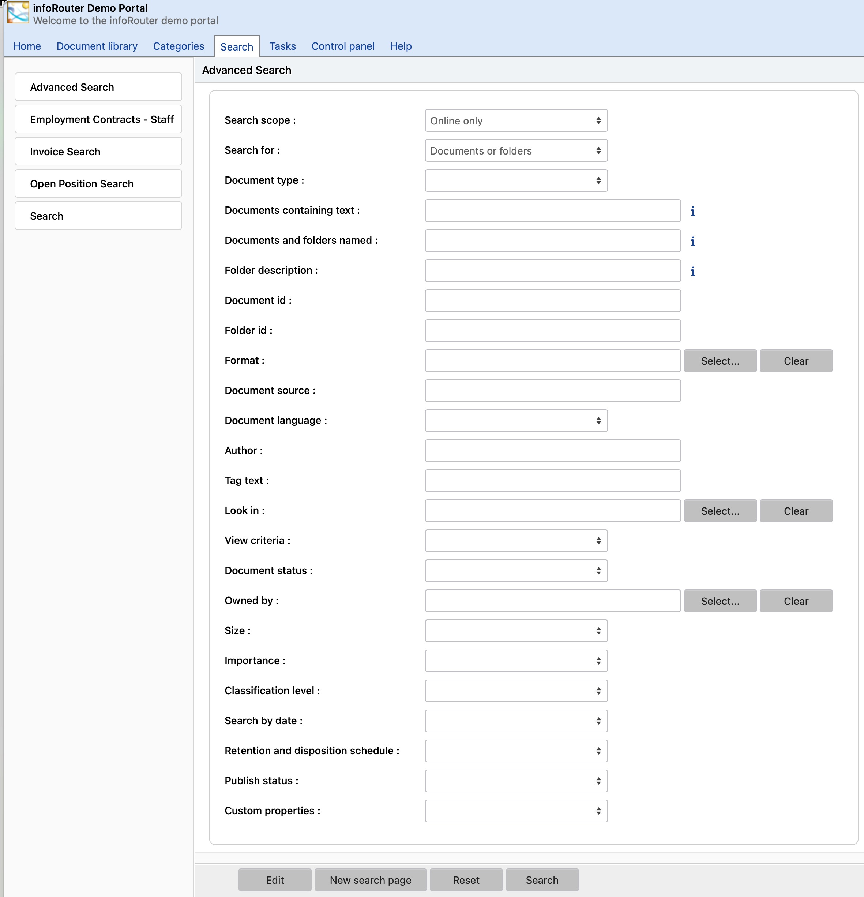

# Advanced Search

## [Getting Started](#c1)

[Introduction](intro.aspx)

[Basic Concepts](BasicConcepts.aspx)

[Getting Started](GettingStarted.aspx)

[How to access infoRouter](AccessingInfoRouter.aspx)

[How to Login to infoRouter](Login.aspx)

[The infoRouter Work Area](WorkArea.aspx)

[Selecting columns to view](SelColumns.aspx)

## [The Menu System](#c2)

[The Menu System Introduction](TheMenuSystem.aspx)

[The New Menu](MenuNew.aspx)

[The Edit Menu](MenuEdit.aspx)

[The Tools Menu](MenuTools.aspx)

[The Advanced Menu](MenuAdvanced.aspx)

[The View Menu](MenuView.aspx)

[The Filter Menu](MenuFilter.aspx)

[Custom Menus](MenuCustom.aspx)

## [Working with Documents](#c3)

[Introduction](Documents.aspx)

[Viewing Documents](ViewDocument.aspx)

[Editing documents](EditingDocuments.aspx)

[Checking in documents](CheckIn.aspx)

[Checking out documents](CheckOutScreen.aspx)

[How to create documents](HowtoCreateDocuments.aspx)

[Creating documents](CreatingDocuments.aspx)

[Creating documents using WebDAV](WebdavDocuments.aspx)

[Creating documents with Zip Uploads](UsingZipUpload.aspx)

[Creating documents with Form Templates](UsingFormTemplates.aspx)

[Version control](VersionControl.aspx)

[Publishing](Publishing.aspx)

[Document Types](DocumentTypes.aspx)

[Deleting documents](DeleteDocument.aspx)

[Recovering deleted documents](RecycleBin.aspx)

[Archiving documents](ArchivingDocuments.aspx)

[Completing documents](CompletingDocuments.aspx)

[Copying and moving documents](CopyMoveDocuments.aspx)

[Classifying and de-classifying documents](ClassDeClassDocuments.aspx)

[Tagging documents](TaggingDocuments.aspx)

[Document properties](DocumentProperties.aspx)

[Distributing documents](SendTo.aspx)

[Document comments](DocumentComments.aspx)

[Document keywords](DocumentKeywords.aspx)

[Document associations](Associations.aspx)

[Shortcuts](DocumentShortcuts.aspx)

[URLs](URLs.aspx)

[E-mail documents](EmailDocuments.aspx)

[Document ownership](DocOwnership.aspx)

[Document thumbnails](Thumbnails.aspx)

[Download Queue](Downloadqueue.aspx)

[Periodic (ISO) Reviews](PeriodicReviews.aspx)

[Upload Document](UploadDocument.aspx)

[Audit Log Document](AuditLogDocument.aspx)

## [Working with Folders](#c4)

[Introduction](Folders.aspx)

[Viewing folders](ViewFolder.aspx)

[Creating folders](CreateFolder.aspx)

[Deleting folders](DeleteFolder.aspx)

[Setting folder rules](FolderRules.aspx)

[Folder properties](ViewFolderProperties.aspx)

[Compacting folders](CompactFolder.aspx)

[Moving folders](MovingFolders.aspx)

[Audit Log](AuditLog.aspx)

[Audit Log folder](AuditLogFolder.aspx)

[Folder view styles](FolderViewStyles.aspx)

[Folder statistics](FolderStats.aspx)

[Folder view styles](MenuView.aspx)

[Automatic prompts](FolderPrompts.aspx)

[Folder ownership](FolderOwnership.aspx)

## [Working with Form Templates](#c5)

[Introduction](FormTemplatesIntro.aspx)

[Creating form templates](CreatingFormTemplates.aspx)

[Deleting form templates](DeletingFormTemplates.aspx)

[Using form templates](UsingFormTemplates.aspx)

[Usage scenarios](FormTemplateScenarios.aspx)

[Form rendering options](RenderingOptions.aspx)

## [infoRouter Portals](#c6)

[Introduction](PortalsIntro.aspx)

[How to create portals](CreatingPortals.aspx)

[Designing portals](DesigningPortals.aspx)

[Portal gadgets](Gadgets.aspx)

[Portal Administrators](PortalAdmins.aspx)

[Setting Up portal administrators](SettingUpPortalAdmins.aspx)

[Examples and usage scenarios](PortalScenarios.aspx)

[Customizing Portals - Personalization](CustomizingPortals.aspx)

## [Searching for documents and folders](#c7)

[Searching](searchbook.aspx)

[Content Search](ContentSearch.aspx)

[Advanced Search](AdvancedSearch.aspx)

[Searching with Saved Searches](UsingSavedSearches.aspx)

[Searching with Custom Properties](SearchingCustomProperties.aspx)

[Ignored Keywords](IgnoredKeywords.aspx)

[Creating Saved Searches](CreatingSavedSearches.aspx)

[Categories](Categories.aspx)

[Creating Categories](CreatingCategories.aspx)

[Editing Categories](EditingCategories.aspx)

[Deleting Categories](DeletingCategories.aspx)

[Category Administration](CategoryAdministrators.aspx)

## [User Profile](#c8)

[Introduction](PersonalDashboard.aspx)

[My Documents](MyDocuments.aspx)

[My Subscriptions](MySubscriptions.aspx)

[My Checked Out Documents](MyCheckedOutDocuments.aspx)

[My Favorites](MyFavorites.aspx)

[My Tasks](MyTasks.aspx)

[My Download Queue](Downloadqueue.aspx)

[My Recycle Bin](MyRecycleBin.aspx)

[My Profile](UserProfile.aspx)

[Recent Documents](RecentDocuments.aspx)

## [Custom Property Sets (Meta Data)](#c9)

[Introduction](CustomPropertyIntro.aspx)

[Creating Custom Property Sets](HowtoCreateCustomPropertySets.aspx)

[Editing Custom Property Sets](EditingCustomPropertySets.aspx)

[Applying Custom Property Sets](ApplyingCustomPropertySets.aspx)

[Searching with Custom Properties](SearchingCustomProperties.aspx)

[Usage scenarios](CustomPropertySets.aspx)

## [Archiving](#c10)

[Introduction](ArchiveIntro.aspx)

[Archiving libraries](ArchivingLibraries.aspx)

[Archiving Documents](ArchivingDocuments.aspx)

## [Document Libraries](#c11)

[Introduction](Libraries.aspx)

[Creating Libraries](CreatingLibraries.aspx)

[Deleting Libraries](DeletingLibraries.aspx)

[Archiving Libraries](ArchivingLibraries.aspx)

[Library Members](LibraryMembers.aspx)

[Adding Library Members](AddingLibraryMembers.aspx)

[Library Usage Scenarios](LibraryUsageScenarios.aspx)

[Library Policies](LibraryPolicies.aspx)

## [Tasks](#c12)

[Introduction](TasksIntro.aspx)

[How to create tasks](HowtoCreateTasks.aspx)

[How to view your tasks](MyTasks.aspx)

[How to complete tasks](HowtoCompleteTasks.aspx)

[Redirecting tasks to other users](TaskRedirection.aspx)

## [Workflows](#c13)

[Introduction](WorkflowsIntro.aspx)

[How to create a Workflow](HowtoCreateWorkflowDefinitions.aspx)

[Submitting documents to Workflow](AuthorReviews.aspx)

[Workflow Reports](Workflow-Reports.aspx)

## [WebDAV](#c14)

[Introduction](WebdavIntro.aspx)

[Setting up WebDAV](WebdavSetup.aspx)

[Using infoRouter WebDAV](UsingWebdav.aspx)

## [Subscriptions](#c15)

[Introduction](Subscriptions.aspx)

[Subscribing](Subscribing.aspx)

[Unsubscribing](Unsubscribing.aspx)

## [Notifications and e-mail](#c16)

[Introduction](Notifications.aspx)

[Send To](SendTo.aspx)

[Subscription Notifications](SubscriptionNotifications.aspx)

[Task Notifications](TaskNotifications.aspx)

[Comment Notifications](CommentNotifications.aspx)

## [Security](#c17)

[Introduction](Security.aspx)

[User Authentication](Authentication.aspx)

[Document Security](DocumentSecurity.aspx)

[Folder Security](FolderSecurity.aspx)

[Inheritance](Inheritance.aspx)

[Auditing Logins](LoginLog.aspx)

[Security Scenarios](SecurityScenarios.aspx)

## [Retention & Disposition](#c18)

[Introduction](Retention.aspx)

[Document Retention](DocumentRetention.aspx)

[Folder Retention](FolderRetention.aspx)

[Disposition](Disposition.aspx)

[Retention and Disposition Schedules](RDSchedules.aspx)

## [Additional Modules and Add-ins](#c19)

[Introduction](Modules.aspx)

[Office Add-in](OfficeAddin.aspx)

[Hot Folders](HotFolders.aspx)

[Scan Station](ScanStation.aspx)

[Import Export Tool](ImportExport.aspx)

[E-mail Scanner](EmailScanner.aspx)

## [Administrative Functions & Tasks](#c20)

[Introduction](AdminFunctions.aspx)

[System Audit Log (Control Panel)](AuditLogControlPanel.aspx)

[Authentication and Password Policies](AuthPassPolicies.aspx)

[E-mail Settings](EmailSettings.aspx)

[Managing MIME Types](MimeTypes.aspx)

[Recycle Bin Management](ManageRecycleBin.aspx)

[Warehouse Management](WarehouseManagement.aspx)

[Application Settings](ApplicationSettings.aspx)

[Creating Document Types](CreatingDocumentTypes.aspx)

[Managing Document Tags](DefiningTags.aspx)

[User Authentication](Authentication.aspx)

[User Synchronization with LDAP](LDAPSynchronization.aspx)

## [Users and User Management](#c21)

[Introduction](Users.aspx)

[Adding Users](AddingUsers.aspx)

[Importing Users](ImportingNTUsers.aspx)

[Deleting Users](DeletingUsers.aspx)

[User Groups](UserGroups.aspx)

[Local User Groups](LocalUserGroups.aspx)

[Transferring ownership](TransferOwnership.aspx)

[Roles - Administrators](Administrators-User-Group.aspx)

[Roles - Audit Managers](AuditManagers.aspx)

[Roles - Policy Managers](PolicyManagers.aspx)

[Roles - User Managers](UserManagers.aspx)

[Roles - Library Managers](LibraryManagers.aspx)

[Roles - Portal Administrators](PortalAdmins.aspx)

[Roles - Search & Category Administrators](CategoryAdministrators.aspx)

# Search / Advanced Search

The "Advanced Search" screen allows users to specify multiple search criteria to find documents stored in infoRouter.

To perform an "Advanced Search", perform the following:

* Click on the "Search" tab.
* The "Advanced Search" window will appear.
    
  Here, you may specify one or more search criteria to use when searching for documents and folders.
* You can click on one of the "saved search" links on the left side of the screen to display other search windows.
* Specify your search criteria in the following sections described below.

Search Scope:

The search scope prompt allows you to limit your search to documents that are:

* Online Only
* All Documents
* Archive Only
* Online Including Hidden Libraries

The default value is "Online Only".

If you are looking for documents that may be online and in the archive choose the "All Documents" option to search with a broader scope. If you know that you are searching for a document that has been archived, limit your search to "Archive Only" to narrow your search scope for a shorter result set.

Search for:

This prompt will allow you to limit your search to certain types of objects in infoRouter. Choose "Documents Only" to limit your search results to only documents. Choose "Folders Only" to limit your search results to only folders. The other options in this drop down prompt will allow you to limit your search to documents marked as being of a specific document type.

Document Type:

This dropdown allows you to limit your search to certain document types. Choosing nothing will search for all document types.

Documents Containing Text:

All documents containing the text (either in the body of the document or Meta contents) entered in this prompt will be returned in "Rank" order. A full-text search will be performed to return all matching documents with the text specified will be gathered. Among the gathered result set, a security check will be performed to match the user's security permissions against the documents. The documents that the user has at least "Read" permission will be displayed to the user performing the search.

Documents and Folders Named:

Text entered here will be used to search against the names of documents and folders. The text of the documents will not be searched; just the names. You may use an asterisk (\*) to indicate that you have entered a partial document name.

Example:

If you are looking for a document called "Accounting.doc", you may either type in "Accounting.doc" or a partial document name such as:

* Acc\*
* \*ing.doc
* \*.doc

[Ignored Keyword List](IgnoredKeywords.aspx)

Document ID:

All documents in infoRouter are assigned a unique document id. Use this prompt to search by this internal id number. You can obtain this number by navigating to the document properties window of any document.

Owned By:

If you know the name of the user who created the document, you can run a search based on owner by selecting a user from the list.

Look In:

By selecting a specific folder, you may restrict the search for documents to only those documents contained in the selected folder and its subfolder(s), if any.

Document Status:

Use this criterion to search for documents that you know to be "Checked In" or "Checked Out".

Search By Date:

If you would like to search for a document based on date criteria, you must select one of the many options in the "Date Criteria" drop down box.

* Date created
* Register date
* Retain until
* Declassify on
* Downgrade on
* Disposition date
* Cut-off date
* Created Or Modified
* Date modified
* Completed on
* Last ISO/Periodic review date
* Next ISO/Periodic review date
* Expiration date

If you would like to specify a date range:

* Click on the "Between" Radio Button
* Specify a date range

OR

If you would like to specify a range for "In the past..." :

* Click on the "In the past" Radio Button
* Specify a number
* Then select one of the options in the drop down list. These are:

* Day(s)
* Week(s)
* Month(s)
* Year(s)

Size:

Use this field to limit your search to documents that are at least, or at most, a set size as measured in Kilobytes.

Importance:

Use this field to limit your search to documents according to their assigned importance levels (Low, Normal, High, Vital).

Classification Level:

Use this field to limit your search to documents according to their assigned classification levels (No Markings, Declassified, Classified, Secret, Top Secret).

Document Format:

This drop down list allows you to specify a document type. If you know that you are looking for an HTML document, specifying this will eliminate all other types of document from the search list.

View Criteria:

This drop down list has 3 options. If you are searching for documents that you know you have not seen before, select "Documents I have not viewed." This will eliminate all the documents that you have viewed.

If you are looking for documents that have changed since you last viewed them, select "Updated documents".

If you are looking for documents that haven't changed since you last viewed them, select "Unchanged documents".

Document Source:

Use this field to limit your search to documents according to their source.
  
 To search by document source, perform the following:

* Enter a source. This is a freeform entry field so be sure to provide the correct spelling.
* Click on the "Search" button to complete the search.

Document Language:

Use this field to limit your search to documents written in a specific language.

To search by language, perform the following:

* Select a language by clicking on the drop down control.
* Click on the "Search" button to complete the search.

Author:

Use this field to limit your search to documents according to their original author (not the person who published it into infoRouter).

To search by [original] author, perform the following:

* Enter an author. This is a freeform entry field so be sure to provide the correct spelling.
* Click on the "Search" button to complete the search.

Tag Text:

Use this field to limit your search to documents that have been tagged with a specific text.

Retention and Disposition schedule:

Use this field to limit your search to documents that are under a specifies Retention and Disposition schedule.

Publish Status:

Use this field to limit your search to documents that have been published or are in a state that is unpublished.

Custom Properties:

Use this field to limit your search to documents according to their assigned custom properties.

To search by custom properties, perform the following:

* Select a custom property by clicking on the drop down control.
* The search page will refresh to expose the fields in the chosen custom property.
* Select the search criteria from the first set of prompts.
* Enter the corresponding value in the next prompt.
* Repeat the process for as many fields as you like.
* Click on the "Search" button to complete the search.

