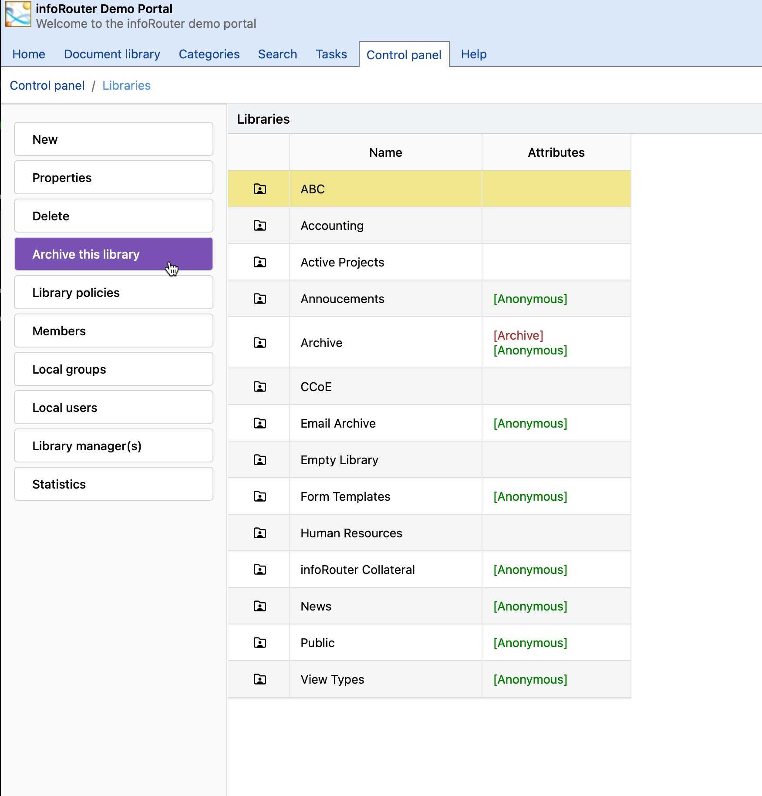

# Archiving Document Libraries

To archive a document library, perform the following:

* Click on the "Control Panel" tab.
* The "Control Panel" window will appear.
* Click on the "Libraries" link.
* Select the library you wish to archive by clicking on it in the list.
* Click on the "Archive this Library" link.
* Confirm that you wish to archive the Library.

Note:

All checked out documents must be checked in before a library can be archived.

Security Considerations:

As with any other operation, archiving a library is subject to security.
  
 Only the System Administrator and members of the “administrators” system user group can archive and un-archive a library.

