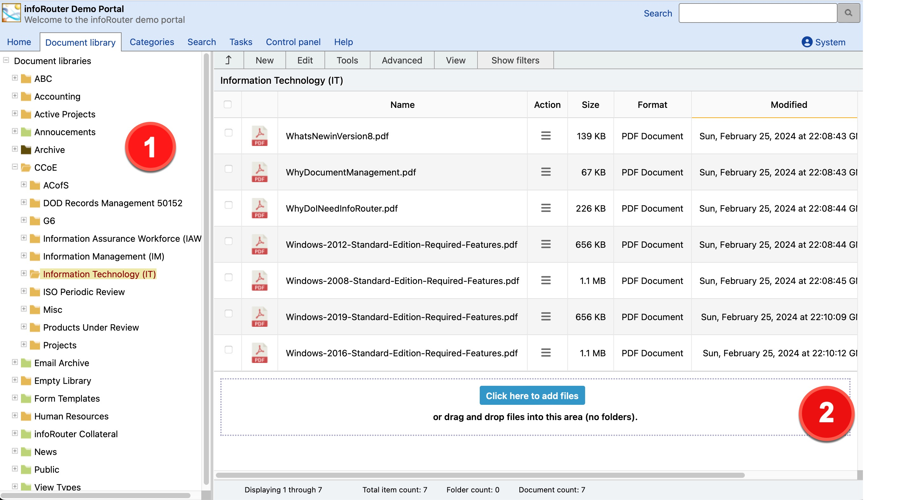

# Basic Concepts - infoRouter Document Management System

## [Getting Started](#c1)

[Introduction](intro.aspx)

[Basic Concepts](BasicConcepts.aspx)

[Getting Started](GettingStarted.aspx)

[How to access infoRouter](AccessingInfoRouter.aspx)

[How to Login to infoRouter](Login.aspx)

[The infoRouter Work Area](WorkArea.aspx)

[Selecting columns to view](SelColumns.aspx)

## [The Menu System](#c2)

[The Menu System Introduction](TheMenuSystem.aspx)

[The New Menu](MenuNew.aspx)

[The Edit Menu](MenuEdit.aspx)

[The Tools Menu](MenuTools.aspx)

[The Advanced Menu](MenuAdvanced.aspx)

[The View Menu](MenuView.aspx)

[The Filter Menu](MenuFilter.aspx)

[Custom Menus](MenuCustom.aspx)

## [Working with Documents](#c3)

[Introduction](Documents.aspx)

[Viewing Documents](ViewDocument.aspx)

[Editing documents](EditingDocuments.aspx)

[Checking in documents](CheckIn.aspx)

[Checking out documents](CheckOutScreen.aspx)

[How to create documents](HowtoCreateDocuments.aspx)

[Creating documents](CreatingDocuments.aspx)

[Creating documents using WebDAV](WebdavDocuments.aspx)

[Creating documents with Zip Uploads](UsingZipUpload.aspx)

[Creating documents with Form Templates](UsingFormTemplates.aspx)

[Version control](VersionControl.aspx)

[Publishing](Publishing.aspx)

[Document Types](DocumentTypes.aspx)

[Deleting documents](DeleteDocument.aspx)

[Recovering deleted documents](RecycleBin.aspx)

[Archiving documents](ArchivingDocuments.aspx)

[Completing documents](CompletingDocuments.aspx)

[Copying and moving documents](CopyMoveDocuments.aspx)

[Classifying and de-classifying documents](ClassDeClassDocuments.aspx)

[Tagging documents](TaggingDocuments.aspx)

[Document properties](DocumentProperties.aspx)

[Distributing documents](SendTo.aspx)

[Document comments](DocumentComments.aspx)

[Document keywords](DocumentKeywords.aspx)

[Document associations](Associations.aspx)

[Shortcuts](DocumentShortcuts.aspx)

[URLs](URLs.aspx)

[E-mail documents](EmailDocuments.aspx)

[Document ownership](DocOwnership.aspx)

[Document thumbnails](Thumbnails.aspx)

[Download Queue](Downloadqueue.aspx)

[Periodic (ISO) Reviews](PeriodicReviews.aspx)

[Upload Document](UploadDocument.aspx)

[Audit Log Document](AuditLogDocument.aspx)

## [Working with Folders](#c4)

[Introduction](Folders.aspx)

[Viewing folders](ViewFolder.aspx)

[Creating folders](CreateFolder.aspx)

[Deleting folders](DeleteFolder.aspx)

[Setting folder rules](FolderRules.aspx)

[Folder properties](ViewFolderProperties.aspx)

[Compacting folders](CompactFolder.aspx)

[Moving folders](MovingFolders.aspx)

[Audit Log](AuditLog.aspx)

[Audit Log folder](AuditLogFolder.aspx)

[Folder view styles](FolderViewStyles.aspx)

[Folder statistics](FolderStats.aspx)

[Folder view styles](MenuView.aspx)

[Automatic prompts](FolderPrompts.aspx)

[Folder ownership](FolderOwnership.aspx)

## [Working with Form Templates](#c5)

[Introduction](FormTemplatesIntro.aspx)

[Creating form templates](CreatingFormTemplates.aspx)

[Deleting form templates](DeletingFormTemplates.aspx)

[Using form templates](UsingFormTemplates.aspx)

[Usage scenarios](FormTemplateScenarios.aspx)

[Form rendering options](RenderingOptions.aspx)

## [infoRouter Portals](#c6)

[Introduction](PortalsIntro.aspx)

[How to create portals](CreatingPortals.aspx)

[Designing portals](DesigningPortals.aspx)

[Portal gadgets](Gadgets.aspx)

[Portal Administrators](PortalAdmins.aspx)

[Setting Up portal administrators](SettingUpPortalAdmins.aspx)

[Examples and usage scenarios](PortalScenarios.aspx)

[Customizing Portals - Personalization](CustomizingPortals.aspx)

## [Searching for documents and folders](#c7)

[Searching](searchbook.aspx)

[Content Search](ContentSearch.aspx)

[Advanced Search](AdvancedSearch.aspx)

[Searching with Saved Searches](UsingSavedSearches.aspx)

[Searching with Custom Properties](SearchingCustomProperties.aspx)

[Ignored Keywords](IgnoredKeywords.aspx)

[Creating Saved Searches](CreatingSavedSearches.aspx)

[Categories](Categories.aspx)

[Creating Categories](CreatingCategories.aspx)

[Editing Categories](EditingCategories.aspx)

[Deleting Categories](DeletingCategories.aspx)

[Category Administration](CategoryAdministrators.aspx)

## [User Profile](#c8)

[Introduction](PersonalDashboard.aspx)

[My Documents](MyDocuments.aspx)

[My Subscriptions](MySubscriptions.aspx)

[My Checked Out Documents](MyCheckedOutDocuments.aspx)

[My Favorites](MyFavorites.aspx)

[My Tasks](MyTasks.aspx)

[My Download Queue](Downloadqueue.aspx)

[My Recycle Bin](MyRecycleBin.aspx)

[My Profile](UserProfile.aspx)

[Recent Documents](RecentDocuments.aspx)

## [Custom Property Sets (Meta Data)](#c9)

[Introduction](CustomPropertyIntro.aspx)

[Creating Custom Property Sets](HowtoCreateCustomPropertySets.aspx)

[Editing Custom Property Sets](EditingCustomPropertySets.aspx)

[Applying Custom Property Sets](ApplyingCustomPropertySets.aspx)

[Searching with Custom Properties](SearchingCustomProperties.aspx)

[Usage scenarios](CustomPropertySets.aspx)

## [Archiving](#c10)

[Introduction](ArchiveIntro.aspx)

[Archiving libraries](ArchivingLibraries.aspx)

[Archiving Documents](ArchivingDocuments.aspx)

## [Document Libraries](#c11)

[Introduction](Libraries.aspx)

[Creating Libraries](CreatingLibraries.aspx)

[Deleting Libraries](DeletingLibraries.aspx)

[Archiving Libraries](ArchivingLibraries.aspx)

[Library Members](LibraryMembers.aspx)

[Adding Library Members](AddingLibraryMembers.aspx)

[Library Usage Scenarios](LibraryUsageScenarios.aspx)

[Library Policies](LibraryPolicies.aspx)

## [Tasks](#c12)

[Introduction](TasksIntro.aspx)

[How to create tasks](HowtoCreateTasks.aspx)

[How to view your tasks](MyTasks.aspx)

[How to complete tasks](HowtoCompleteTasks.aspx)

[Redirecting tasks to other users](TaskRedirection.aspx)

## [Workflows](#c13)

[Introduction](WorkflowsIntro.aspx)

[How to create a Workflow](HowtoCreateWorkflowDefinitions.aspx)

[Submitting documents to Workflow](AuthorReviews.aspx)

[Workflow Reports](Workflow-Reports.aspx)

## [WebDAV](#c14)

[Introduction](WebdavIntro.aspx)

[Setting up WebDAV](WebdavSetup.aspx)

[Using infoRouter WebDAV](UsingWebdav.aspx)

## [Subscriptions](#c15)

[Introduction](Subscriptions.aspx)

[Subscribing](Subscribing.aspx)

[Unsubscribing](Unsubscribing.aspx)

## [Notifications and e-mail](#c16)

[Introduction](Notifications.aspx)

[Send To](SendTo.aspx)

[Subscription Notifications](SubscriptionNotifications.aspx)

[Task Notifications](TaskNotifications.aspx)

[Comment Notifications](CommentNotifications.aspx)

## [Security](#c17)

[Introduction](Security.aspx)

[User Authentication](Authentication.aspx)

[Document Security](DocumentSecurity.aspx)

[Folder Security](FolderSecurity.aspx)

[Inheritance](Inheritance.aspx)

[Auditing Logins](LoginLog.aspx)

[Security Scenarios](SecurityScenarios.aspx)

## [Retention & Disposition](#c18)

[Introduction](Retention.aspx)

[Document Retention](DocumentRetention.aspx)

[Folder Retention](FolderRetention.aspx)

[Disposition](Disposition.aspx)

[Retention and Disposition Schedules](RDSchedules.aspx)

## [Additional Modules and Add-ins](#c19)

[Introduction](Modules.aspx)

[Office Add-in](OfficeAddin.aspx)

[Hot Folders](HotFolders.aspx)

[Scan Station](ScanStation.aspx)

[Import Export Tool](ImportExport.aspx)

[E-mail Scanner](EmailScanner.aspx)

## [Administrative Functions & Tasks](#c20)

[Introduction](AdminFunctions.aspx)

[System Audit Log (Control Panel)](AuditLogControlPanel.aspx)

[Authentication and Password Policies](AuthPassPolicies.aspx)

[E-mail Settings](EmailSettings.aspx)

[Managing MIME Types](MimeTypes.aspx)

[Recycle Bin Management](ManageRecycleBin.aspx)

[Warehouse Management](WarehouseManagement.aspx)

[Application Settings](ApplicationSettings.aspx)

[Creating Document Types](CreatingDocumentTypes.aspx)

[Managing Document Tags](DefiningTags.aspx)

[User Authentication](Authentication.aspx)

[User Synchronization with LDAP](LDAPSynchronization.aspx)

## [Users and User Management](#c21)

[Introduction](Users.aspx)

[Adding Users](AddingUsers.aspx)

[Importing Users](ImportingNTUsers.aspx)

[Deleting Users](DeletingUsers.aspx)

[User Groups](UserGroups.aspx)

[Local User Groups](LocalUserGroups.aspx)

[Transferring ownership](TransferOwnership.aspx)

[Roles - Administrators](Administrators-User-Group.aspx)

[Roles - Audit Managers](AuditManagers.aspx)

[Roles - Policy Managers](PolicyManagers.aspx)

[Roles - User Managers](UserManagers.aspx)

[Roles - Library Managers](LibraryManagers.aspx)

[Roles - Portal Administrators](PortalAdmins.aspx)

[Roles - Search & Category Administrators](CategoryAdministrators.aspx)

# Basic Concepts / Basic Document Management concepts you should know about

Please review this section to familiarize yourself with basic infoRouter Document Management concepts.

Libraries:

Libraries (infoRouter work areas) are root-level folders. They can be seen on the left of the image above labeled 1.
Libraries are isolated environments in which a group of users can work, collaborate and produce documents.

Only the members of libraries can navigate inside libraries or even see that they exist.
Users and User Groups are assigned as "Members" to libraries by the System Administrator and
by the members of the "Administrators" and the "User Managers" system user group.
More on this topic in [Libraries](Libraries.aspx).

Folders:

Folders are used to store and organize documents.
  
 Folders may contain any number of documents in a wide variety of file formats.
  
 Like libraries, access to folders is subject to security permissions. Users may be granted or denied access
to individual folders. More on this topic in [Folders](Folders.aspx).

Documents Pane:

Documents are shown on the right hand side of the screen in the documents pane, labeled 2.

The documents pane contains documents which can be virtually any electronic file produced by applications such as Microsoft Word, Microsoft Excel, Microsoft PowerPoint , WordPerfect, Visio, or any other type of electronic files such as audio and video files.

infoRouter manages all types of electronic documents in their native format. In other words, it does not attempt to convert or interfere with document content. More on this topic in [Documents](Documents.aspx).

Custom Properties (Meta data):

Custom Property Sets are user defined information sets that can be attached to folders, documents and users. They are used to further define the document, folder or user. A common use for this feature is to allow documents to be searched based on custom information, rather than just their name or content. More on this topic in
[Custom Properties](CustomPropertyIntro.aspx).

Portals:

infoRouter portals are customizable and can be personalized web pages that are capable of serving infoRouter content. Their main purpose is to greet users and provide content specific to users or a group of users. You may use infoRouter portals to create web pages for your partners, vendors and employees to provide colorful content rather than a dry list of folders and files. Because they are capable of serving content, you may choose to design portals that provide critical content all on the portal and avoid having to allow navigation into the document library. More on this topic in [Portals](PortalsIntro.aspx).

Content Searching:

infoRouter is capable of performing an internet-like search on documents and folders based on their content. Various common file formats are indexed giving infoRouter users the ability to search for documents based on their text content. You can use various third-party plug-ins called "**iFilters**" to broaden the range of file formats that can be indexed. More on this topic in [Searching in infoRouter](searchbook.aspx).

Version Control:

infoRouter retains multiple versions of a document. Every time a document is checked out, edited and checked back in, infoRouter creates a new copy of this document and retains all previous versions. All versions are retained until the owner of the document or an authorized user decides to clean up previous versions.

When you click on a document to view its contents, infoRouter delivers the published version of that document. When you check out a document, infoRouter will deliver the latest version making it virtually impossible to accidentally work with an older copy.

Version control allows you to revert back to older versions in case undesirable changes have been made to your documents. More on this topic in [Version Control](VersionControl.aspx).