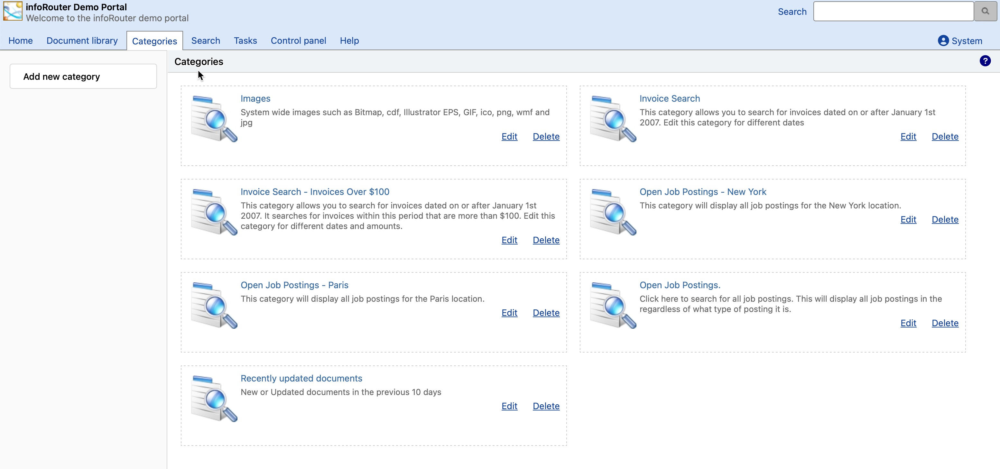

# Categories (Saved Searches)

Categories are pre-defined search queries that group related documents under a common heading. They provide a quick way to find documents without manually entering search criteria.

---

## What Are Categories?

Categories function as saved searches that have been configured by administrators. When you click on a category, infoRouter automatically runs the associated search and displays matching documents.

!!! tip "Quick Document Access"
    Categories provide one-click access to commonly needed document groups, eliminating the need to remember and enter search criteria.

---

## Using Categories

### How to Search with Categories

1. Navigate to the **Categories** tab from the main portal
2. Browse the available category names
3. Click on the category that best describes what you're looking for
4. View the list of documents matching that category

---

## Category Examples

| Category Name | Documents Returned |
|---------------|-------------------|
| Recent Invoices | Invoices from the last 30 days |
| Pending Approvals | Documents waiting for approval |
| HR Policies | All Human Resources policy documents |
| Project Alpha | All documents related to Project Alpha |
| Expiring Contracts | Contracts expiring in the next 60 days |

---

## For Administrators

Categories are created and managed by Category Administrators:

| Task | Description |
|------|-------------|
| [Creating Categories](CreatingCategories.md) | Define new categories and their search criteria |
| [Editing Categories](EditingCategories.md) | Modify existing category settings |
| [Deleting Categories](DeletingCategories.md) | Remove categories no longer needed |
| [Category Administrators](CategoryAdministrators.md) | Manage who can create and edit categories |

---

## See Also

- [Creating Categories](CreatingCategories.md)
- [Editing Categories](EditingCategories.md)
- [Deleting Categories](DeletingCategories.md)
- [Category Administrators](CategoryAdministrators.md)
- [Advanced Search](AdvancedSearch.md)
