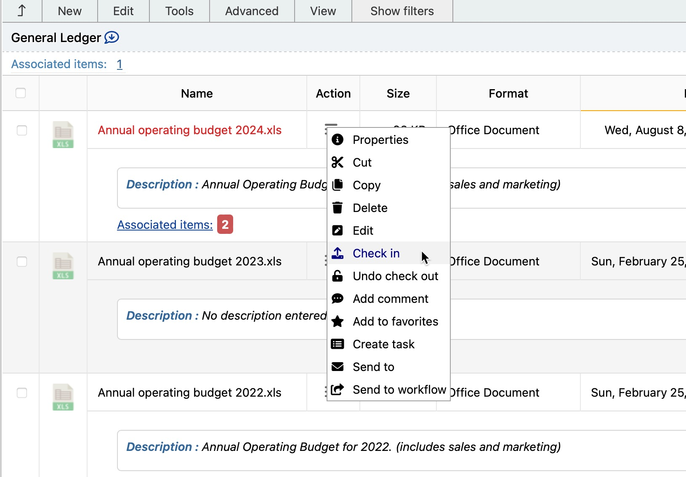
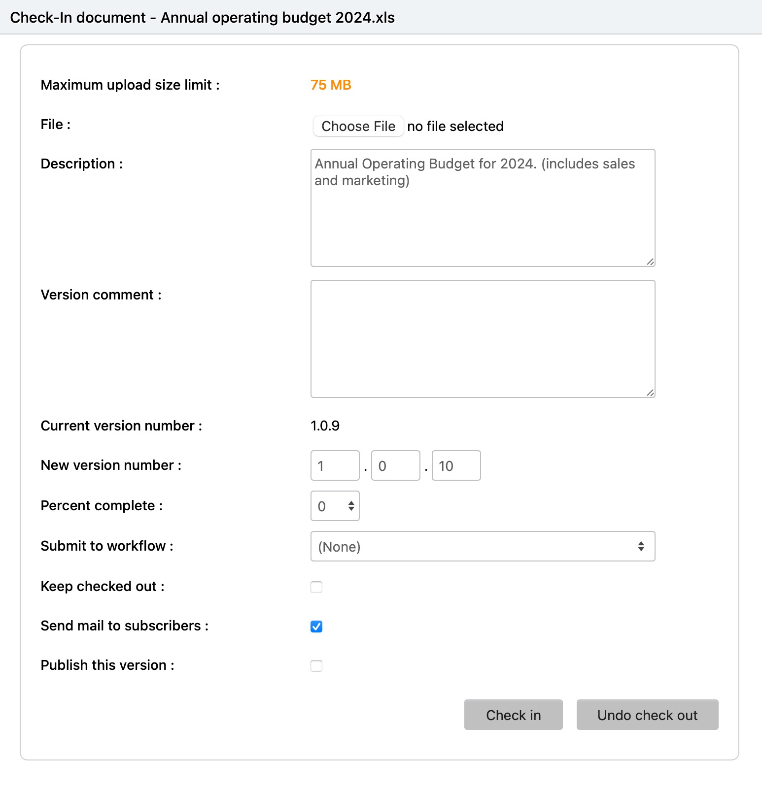

# Documents / Checking Documents In - Creating new document versions.

The infoRouter Document Management Software allows you to create multiple versions of documents. Using this feature, you can revert back to prior versions of documents. The Check In - Check Out mechanism built into the core of the software allows you to maintain document integrity. To make changes to documents, you must first check documents out, make changes then check them back in.

To check a document in perform the following:

1. Click on the "Action" icon and select "Check In" or select the document by clicking on the check box, then choose the "Check In" menu item from the "Edit" menu.
2. At the "Check In" window, click on the "Browse" button to navigate to the path where you downloaded your local copy and made your changes.
3. Enter your comments (optional)
4. Enter "Update Instructions". This information is included in the e-mail notification that goes out to the subscribers of this document (optional).
5. Update the "Percent Complete" information or set a "Completion Date" if you have completed this document.
     
    Note: Marking a document as complete will disallow further edits to this document until the completion date is reset or the percent complete information is set to something other than 100% (optional).
6. If you wish to release a new version of this document but continue to work on it, click on the check box labeled "Keep checked out" (optional).
7. Click on the "Check In" button

Notice that by default, the "Send Mail to Subscribers" is checked. If you feel that you have more work to do with this document and would not like to notify users just yet, then uncheck the "Send Mail to Subscribers" check box.

Force "Check In" :

Force "Check In" is a special right that allows a user to "Check In" a document that is checked out to another user.
This action unlocks the checked out document, allowing other users to check this document out and make changes.

In order to be able to Force "Check In" a document, one of the following is required:

* You must be the owner of the document
* You must have Full Control rights to the document
* You must be the System Administrator.
* You must be a members of the Administrators system user group.
* You must be a Library Manager.

#### To Force "Check In" a document:

* Select a checked out document
* Click on the "Action" icon and choose the "Properties" menu to navigate to the document properties window.
* Scroll down to the section labeled "Checked out by"
* Click on the "Check in" icon in this section
* Confirm that you wish to force check in the document

