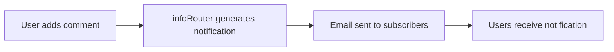

# Comment Notifications

Stay informed when users add comments to documents you're subscribed to.

---

## How Comment Notifications Work

When a document comment is entered, infoRouter automatically sends email notifications to all subscribed users who have enabled comment notifications.

---

## Who Can Add Comments?

| Permission Level | Can Add Comments |
|------------------|------------------|
| Read | :material-check: Yes |
| Write | :material-check: Yes |
| Full Control | :material-check: Yes |
| No Access | :material-close: No |

!!! info "Minimum Requirement"
    Users need at least **Read** permission on a document to add comments.

---

## Notification Contents

Comment notification emails include:

| Field | Description |
|-------|-------------|
| :material-account: **Author** | Name of the user who added the comment |
| :material-calendar: **Date** | When the comment was added |
| :material-text: **Comment Text** | The full content of the comment |
| :material-file-document: **Document** | Link to the commented document |

---

## Receiving Comment Notifications

To receive comment notifications:

1. [Subscribe](Subscribing.md) to the document or folder
2. Enable **Comment Notifications** in your subscription settings

!!! tip "Subscription Settings"
    You can choose which types of notifications you want to receive for each subscription. Enable comment notifications only for documents where you need to track discussions.

---

## See Also

- [Document Comments](DocumentComments.md)
- [Subscribing to Documents](Subscribing.md)
- [Subscription Notifications](SubscriptionNotifications.md)
- [Notifications Overview](Notifications.md)