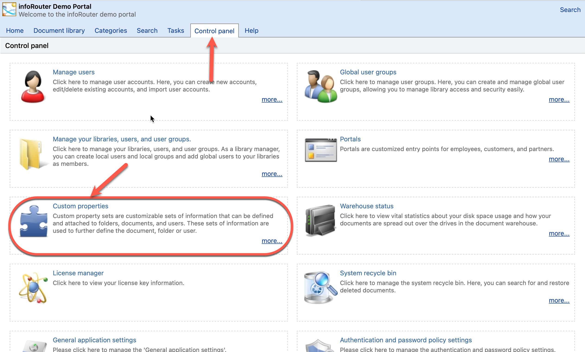

# Custom Property Sets / Definitions

Custom Document Property Sets are user defined Meta Data sets that can be attached to folders and documents. They are used to further define the document or folder.

A common use for this feature is to allow documents to be searched based on custom information, rather than just their name or content.

Examples:

I want every invoice document where the invoice amount is **more than** $400.00
  
I want every invoice document that was issued **after** January 5th, 2015.
  
I want every proposal we wrote to customer XYZ
  
I want every e-mail coming from james@acme.com
  
I want every resume where the hometown is London
  
  

Consider the example where you are looking for invoices in the amount of more than $400.00.
You could easily find the invoices that have an exact invoice amount of $400.00 but what if you needed more than that?

Custom properties allow you to search in ranges. This is much more than a simple full-text search.

Custom Properties can be defined *globally* or at the *library level*. This allows you to create a custom document property set that only appears in one or selected libraries. This way, "Custom Property Sets" that do not apply to certain libraries can be hidden from view.

See also:

[Examples and usage scenarios of Custom Properties](CustomPropertySets.md)

[How to create custom property sets](HowtoCreateCustomPropertySets.md)