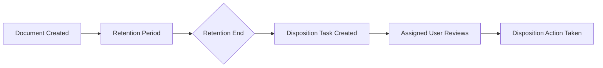

# Document Disposition

Disposition is the process of handling documents that have reached the end of their retention period.

---

## What Is Disposition?

Disposition occurs when documents have been retained for their required period and are no longer needed for active business purposes. The disposition process determines what happens to these documents.

---

## Disposition Options

| Option | Description |
|--------|-------------|
| :material-delete: **Destroy** | Permanently delete the document |
| :material-archive: **Archive** | Move to long-term storage |
| :material-eye-check: **Review** | Manual review before action |
| :material-transfer: **Transfer** | Move to another system or location |

---

## How Disposition Works

1. Document is created with a retention schedule
2. Retention period elapses
3. Disposition task is automatically created (if configured)
4. Task is assigned to the user defined in the schedule
5. Assigned user performs the disposition action manually

---

## Disposition Schedules

Disposition settings are configured in Retention and Disposition schedules:

| Setting | Description |
|---------|-------------|
| **Trigger** | When retention period ends |
| **Assignee** | User responsible for disposition |
| **Action** | What to do with the document |
| **Notification** | Alert sent to assignee |

---

## Manual Disposition

!!! info "Human Review"
    Disposition tasks are performed **manually** by the assigned user. This ensures proper review before permanent actions are taken on documents.

---

## Best Practices

!!! tip "Effective Disposition"
    - Define clear retention schedules
    - Assign disposition responsibility to appropriate users
    - Document disposition decisions for audit purposes
    - Consider legal holds before disposing documents

---

## See Also

- [Document Retention](DocumentRetention.md)
- [Retention Schedules](Retention.md)
- [Folder Retention](FolderRetention.md)
- [Archiving Introduction](ArchiveIntro.md)