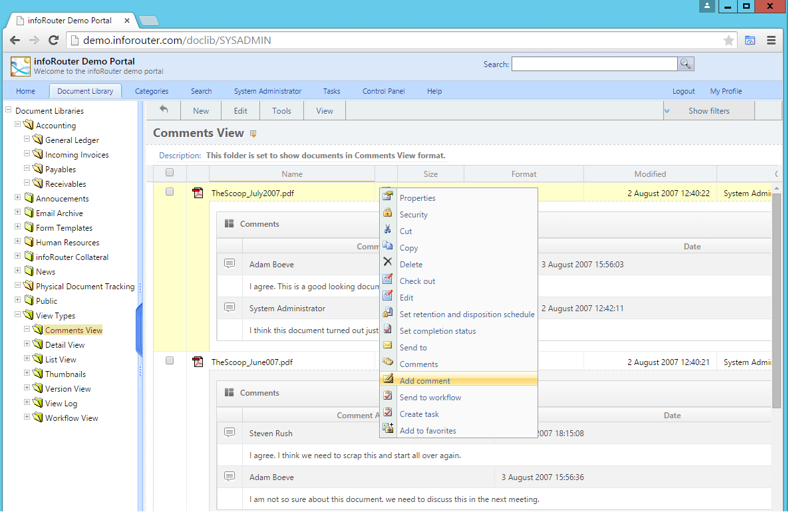
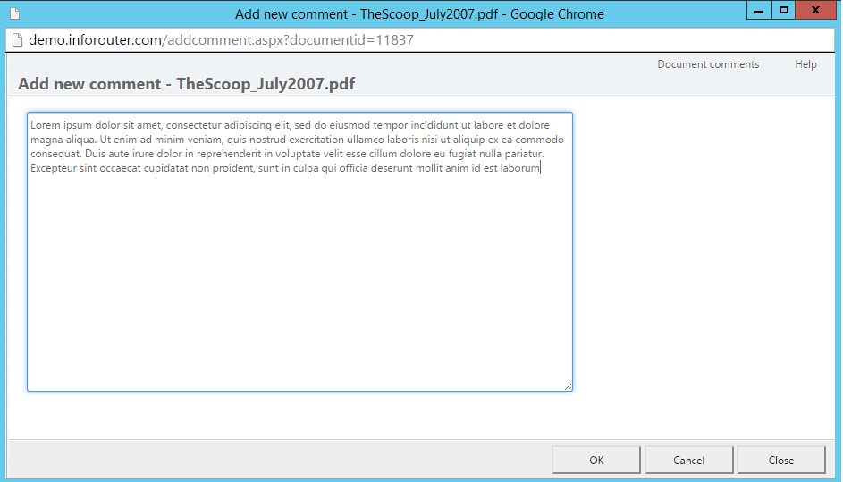
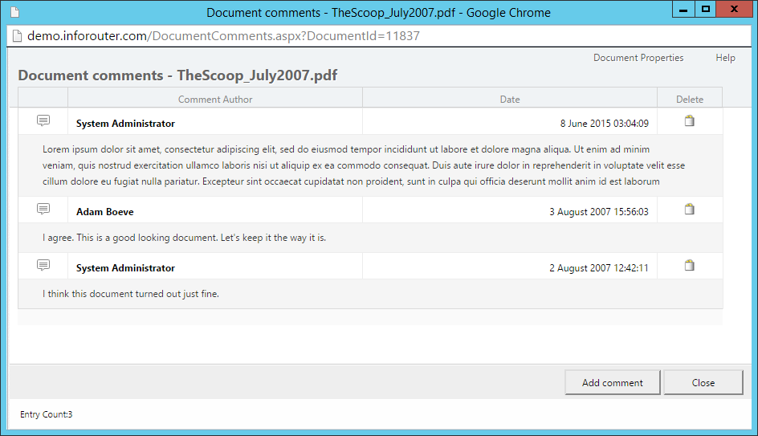

# Document Comments

Comments allow you to add notes and feedback to documents without modifying the document itself.

---

## Adding Comments

!!! note "Permission Required"
    You must have at least **Read** permissions to add comments to a document.

### Method 1: Action Menu

1. Click the **Action** icon on the document
2. Select **Add Comment**
3. Enter your comment in the window that appears
4. Click **OK**

### Method 2: Document Properties

1. Open **Document Properties**
2. Click **Comments** in the left sidebar
3. Click the **Add Comment** button
4. Enter your comment
5. Click **OK**

---

## Deleting Comments

You can delete a comment if:

- You own the document, OR
- You added the comment

### How to Delete

1. Click the **Action** icon → **Document Properties**
2. Click **Comments** in the sidebar
3. Click the **Delete** button next to the comment you want to remove

---

## Version Comments

Version comments are different from document comments — they're attached to specific versions and created when checking in documents.

| Comment Type | When Created | Purpose |
|--------------|--------------|---------|
| **Document Comments** | Anytime | General notes about the document |
| **Version Comments** | During check-in | Notes about specific version changes |

### Viewing Version Comments

1. Open **Document Properties**
2. Click **Versions** in the left sidebar
3. Version-specific comments appear under each version

!!! info "Who Can Add Version Comments"
    Only users with **Change** permissions can add version comments, as they're created during the check-in process.

---

## See Also

- [Document Properties](DocumentProperties.md)
- [Check In Documents](CheckIn.md)
- [Document Versions](DocumentVersions.md)
