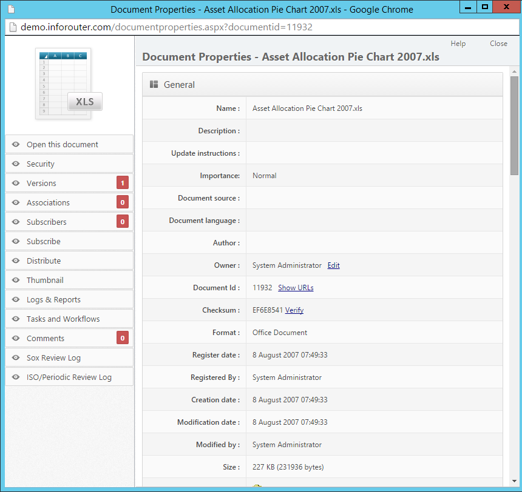

# Document Properties

Document properties contain metadata and settings for each document in infoRouter. View properties by clicking the **Action** icon and selecting **Document Properties**.

---

## Basic Information

| Property | Description |
|----------|-------------|
| **Name** | Document file name |
| **Description** | Optional description of the document |
| **Update Instructions** | Text included in notification emails to subscribers |
| **Document ID** | Unique internal identifier |

!!! warning "File Naming"
    Do not use these special characters in document names: `\ / : * ? " < > |`

---

## Classification & Importance

### Importance Levels

| Level | Use For |
|-------|---------|
| **Low** | Minor or reference documents |
| **Normal** | Standard documents (default) |
| **High** | Important documents requiring attention |
| **Vital** | Critical documents |

### Classification Levels

| Level | Description |
|-------|-------------|
| **No Markings** | Unclassified |
| **Declassified** | Previously classified, now released |
| **Confidential** | Limited distribution |
| **Secret** | Restricted access |
| **Top Secret** | Highly restricted |

---

## Metadata Fields

| Property | Description |
|----------|-------------|
| **Document Source** | Original source of the document |
| **Document Language** | Language the document is written in |
| **Author** | Original author (may differ from uploader) |
| **Owner** | Current document owner |
| **Keywords** | Search keywords associated with the document |
| **Tags** | Tag values applied to the document |

---

## Date Information

| Property | Description |
|----------|-------------|
| **Register Date** | Date first created in infoRouter (read-only) |
| **Registered By** | User who uploaded the document (read-only) |
| **Creation Date** | Document creation date in infoRouter |
| **Modification Date** | Last modification date |
| **Modified By** | User who last modified the document |

---

## Status Information

| Property | Description |
|----------|-------------|
| **Format** | MIME type (Office Document, PDF, etc.) |
| **Size** | File size in bytes |
| **Folder** | Current location |
| **Document Type** | Category (Financial, Letter, Memo, etc.) |
| **Checksum** | Value for verifying document authenticity |

:material-arrow-right: Learn more: [Creating Document Types](CreatingDocumentTypes.md)

---

## Check Out Status

| Property | Description |
|----------|-------------|
| **Checked Out By** | User who has the document checked out |
| **Check Out Date** | When the document was checked out |
| **Workflow Status** | Current workflow state (if applicable) |

---

## Completion Settings

| Property | Description |
|----------|-------------|
| **Percent Complete** | Progress indicator (0-100%) |
| **Completion Date** | Date marked complete |

!!! note "Completed Documents"
    When a document is set to 100% complete or has a completion date, it **cannot be checked out** until the status is changed.

---

## Retention & Dates

| Property | Description |
|----------|-------------|
| **Retain Until** | Date until which document must be kept |
| **Disposition Date** | Scheduled destruction date |
| **Expiration** | Date document becomes obsolete |
| **Downgrade On** | Date to lower classification level |
| **Declassify On** | Date to remove classification |

---

## Publishing & Review

| Property | Description |
|----------|-------------|
| **Publishing Rules** | Which version users see when viewing |
| **ISO/Periodic Review** | Scheduled review dates |

:material-arrow-right: Learn more: [Publishing](Publishing.md) | [Periodic Reviews](PeriodicReviews.md)

---

## Additional Sections

| Section | Description |
|---------|-------------|
| **Rendering Options** | View document in different formats |
| **Custom Properties** | User-defined metadata fields |

---

## See Also

- [Working with Documents](Documents.md)
- [Document Types](CreatingDocumentTypes.md)
- [Custom Properties](CustomPropertyIntro.md)
- [Publishing](Publishing.md)
