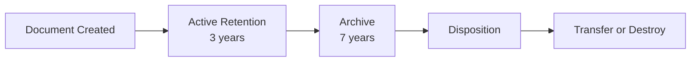

# Document Retention

Protect documents from deletion by applying retention schedules that enforce compliance with legal and business requirements.

---

## What Is Document Retention?

Retention schedules protect documents from deletion until their required retention period has been met. This ensures compliance with:

- Legal requirements
- Regulatory mandates
- Business policies
- Industry standards

---

## How Retention Works

When a retention schedule is applied to a document:

| Protection | Description |
|------------|-------------|
| :material-shield: **Deletion blocked** | Document cannot be deleted |
| :material-lock: **Period enforced** | Protection lasts for defined period |
| :material-calendar-check: **Automatic tracking** | System tracks retention dates |

---

## Retention Example

| Phase | Duration | Action |
|-------|----------|--------|
| **Active** | 3 years | Document retained in original location |
| **Archive** | 7 years | Document moved to archive folder |
| **Disposition** | — | Document transferred or destroyed |

---

## Applying Retention Schedules

1. Navigate to the document
2. Click **Action** → **Document Properties**
3. Locate the **Retention** section
4. Select a Retention and Disposition schedule
5. Click **OK**

---

## Retention Status Indicators

| Status | Description |
|--------|-------------|
| :material-shield-check: **Active** | Under retention protection |
| :material-archive: **Archived** | In archive retention phase |
| :material-clock-alert: **Approaching** | Nearing end of retention |
| :material-check-circle: **Complete** | Retention period ended |

---

## Who Can Apply Retention?

| Role | Can Apply Retention |
|------|---------------------|
| Document Owner | :material-check: Yes |
| Users with Full Control | :material-check: Yes |
| Library Managers | :material-check: Yes |

---

## See Also

- [Retention Schedules](Retention.md)
- [Document Disposition](Disposition.md)
- [Folder Retention](FolderRetention.md)
- [Document Properties](DocumentProperties.md)