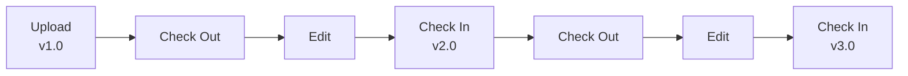

# Document Versions

infoRouter automatically tracks document versions, maintaining a complete history of changes over time.

---

## How Versioning Works

Every time a document is checked in, a new version is created:

---

## Version Information

Each version records:

| Information | Description |
|-------------|-------------|
| :material-numeric: **Version Number** | Sequential identifier (1.0, 2.0, etc.) |
| :material-account: **Modified By** | User who created the version |
| :material-calendar: **Date/Time** | When the version was created |
| :material-file-document: **File Size** | Size of that version |
| :material-comment-text: **Comments** | Check-in comments |

---

## Viewing Version History

1. Navigate to the document
2. Click the **Action** icon
3. Select **Document Properties**
4. Click **Versions** in the sidebar

---

## Working with Versions

### View a Previous Version

1. Open the version history
2. Click on the version number to view

### Download a Previous Version

1. Open the version history
2. Click the **Download** icon next to the version

### Delete a Version

1. Open the version history
2. Select the version(s) to delete
3. Click **Delete**

!!! warning "Version Deletion"
    Deleted versions cannot be recovered. Ensure you have the correct version selected.

---

## Version Comparison

Compare two versions to see what changed:

1. Open the version history
2. Select two versions
3. Click **Compare**
4. View the differences

---

## Publishing and Versions

| Setting | Behavior |
|---------|----------|
| **Latest Version** | Users see the most recent version |
| **Approved Version** | Users see the last approved version |
| **Specific Version** | Users see a designated version |

:material-arrow-right: Learn more: [Publishing](Publishing.md)

---

## Version Limits

!!! info "Library Policy"
    Libraries can set policies to limit the number of versions retained. When the limit is reached, oldest versions are automatically removed.

---

## See Also

- [Check Out Documents](CheckOut.md)
- [Check In Documents](CheckIn.md)
- [Document Properties](DocumentProperties.md)
- [Publishing](Publishing.md)
