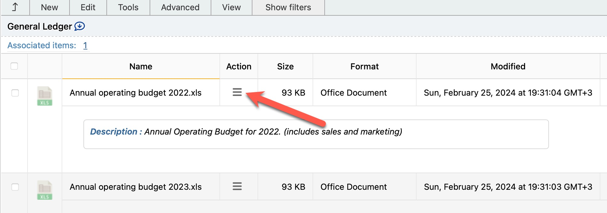
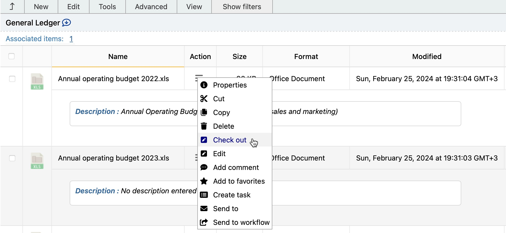

# Editing Documents

To edit a document in infoRouter, you must first check it out. This locks the document so only you can edit it while others can still view it.

!!! tip "Visual Indicator"
    Checked out documents appear **RED** in the document list, making them easy to identify.

---

## How to Edit a Document

### Step 1: Check Out the Document

**Method 1: Edit Menu**

1. Select the document(s) by clicking the checkbox
2. Go to **Edit** → **Check Out**

**Method 2: Action Menu**

1. Click the **Action** icon on the document
2. Select **Check Out**

### Step 2: Download and Edit

1. Click on the document to download it
2. Open the document with its native application
3. Make your desired changes
4. Save the document locally

### Step 3: Check In the Document

After editing, [check in](CheckIn.md) the document to:

- Release the document lock
- Create a new version with your changes
- Make changes available to others

---

## Who Can Edit Documents?

| Role | Can Edit |
|------|----------|
| Users with **Change** rights | :material-check: Yes |
| Users with **Full Control** | :material-check: Yes |
| Library Manager | :material-check: Yes |
| Document Owner | :material-check: Yes |

!!! warning "Library Policies"
    Library policies can override security settings. A library policy may restrict editing even for users who would normally have permission.

:material-arrow-right: Learn more: [Document Security](DocumentSecurity.md)

---

## Important Notes

- Only **one user** can check out a document at a time
- Others can **view** the document while you're editing
- Remember to **check in** when finished to release the lock

---

## See Also

- [Check Out Documents](CheckOut.md)
- [Check In Documents](CheckIn.md)
- [Document Security](DocumentSecurity.md)
- [Document Versions](DocumentVersions.md)
