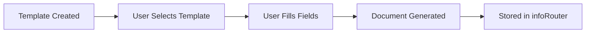

# Introduction to Form Templates

Form Templates allow you to create standardized documents with predefined fields and layouts directly within infoRouter.

---

## What Are Form Templates?

Form Templates are HTML-based document templates that include:

- Predefined layouts and formatting
- Input fields for user data
- Validation rules
- Automatic metadata capture

!!! tip "Standardization"
    Form Templates ensure consistency across documents of the same type, such as invoices, reports, or request forms.

---

## How Templates Work

1. Administrator creates a template with fields
2. User selects the template when creating a document
3. User fills in the required fields
4. infoRouter generates the document
5. Document is stored with all metadata captured

---

## Template Features

| Feature | Description |
|---------|-------------|
| :material-form-textbox: **Field Types** | Text, numbers, dates, dropdowns, checkboxes |
| :material-shield-check: **Validation** | Required fields, format validation |
| :material-database: **Metadata** | Automatic custom property population |
| :material-palette: **Styling** | Custom HTML/CSS formatting |

---

## Benefits

| Benefit | Description |
|---------|-------------|
| **Consistency** | All documents follow the same format |
| **Efficiency** | Pre-built layouts save time |
| **Accuracy** | Validation prevents errors |
| **Searchability** | Captured metadata enables precise searches |

---

## Getting Started

| Task | Description |
|------|-------------|
| [Creating Form Templates](CreatingFormTemplates.md) | Build new templates |
| [Form Template Fields](FormTemplateFields.md) | Configure input fields |
| [Form Template Validation](FormTemplateValidation.md) | Set up validation rules |
| [Using Form Templates](UsingFormTemplates.md) | Create documents from templates |

---

## See Also

- [Creating Form Templates](CreatingFormTemplates.md)
- [Form Template Fields](FormTemplateFields.md)
- [Using Form Templates](UsingFormTemplates.md)
- [Working with Documents](Documents.md)
