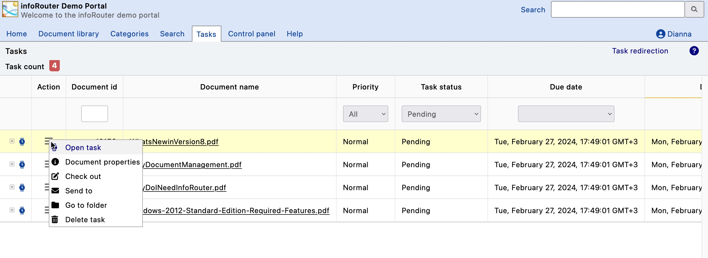
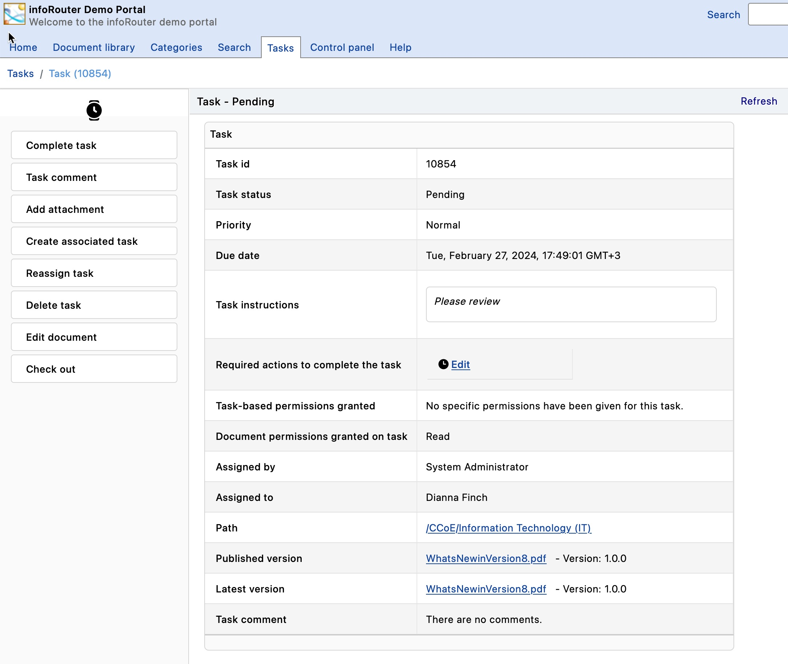

# Tasks / How to complete tasks

If you have been assigned a task and wish to complete the task, please perform the following:

1. Navigate to the "My Tasks" tab to display tasks that are associated with you.
2. For information on how you can filter through your tasks read [My Tasks](MyTasks.md)
3. Once you find the task you wish to complete, click on the task icon in the "Action" column.
4. This will launch the "Task" window where you will be able to see the task details.
5. Pay special attention to the section labeled "Task requirements"
6. Here in this section will be a list of requirements you must satisfy before the task can be marked as complete.
7. Notice that as you perform the requirements a green check mark will appear to the left of the completed requirements.
8. Once all the requirements are completed, click on the "Complete task" link located in the left sidebar.

See Also:

[My Tasks](MyTasks.md)