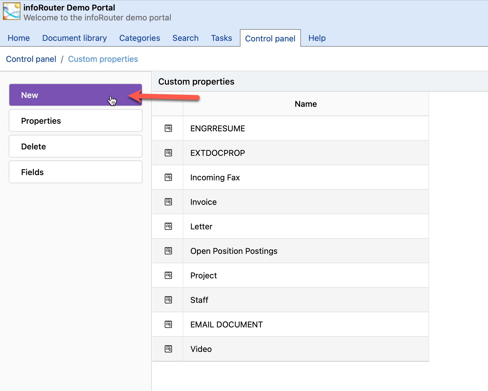
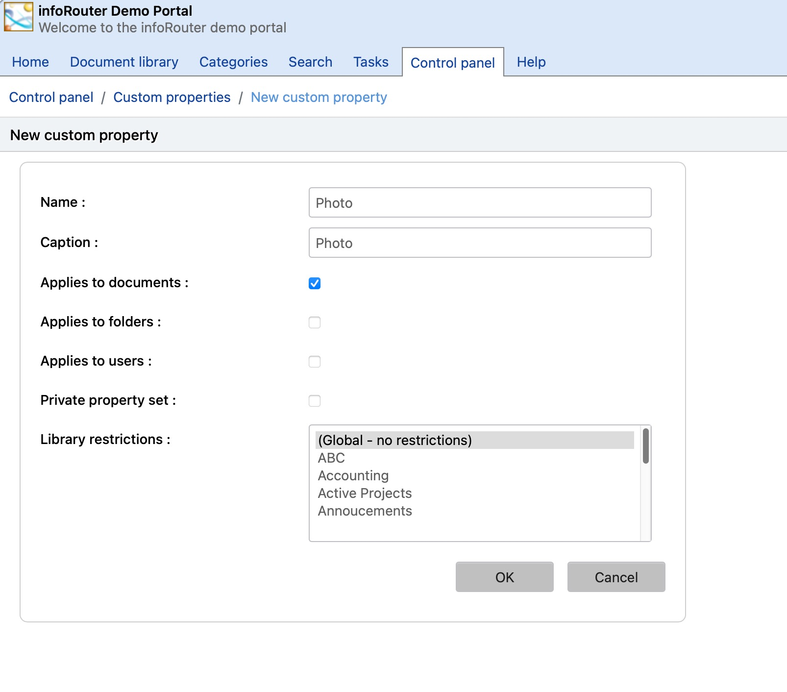

# Custom Property Sets / Creating a Custom Property Set

To create a Custom Property Set, perform the following:

1. Navigate to the infoRouter "Control Panel".
2. Click on the "Custom Properties" link.
3. Click on the "New" link located in the left sidebar.
     
   
4. Enter the Name and Caption for the property set you wish to create. Please make sure not to use spaces or special characters.
5. Select the appropriate check boxes to specify if this new custom property applies to "Documents", "Folders" and "Users".
6. Check the "Private property set" box if you wish to make this custom property set only visible to logged in users.
7. Select the library in which you wish to activate this new custom property. If you wish to make the custom property available in all libraries, select the "Global - No restriction" (default option) option.
8. Click "Ok" to create the custom property header.
     
   
9. The "Custom Property Fields" window will appear.

You must now define the custom property set fields

The fields you create here will be the prompts for the property set.

Field Types:

1. Text Box
     
    General Text entry such as name, last name, city, state etc.
2. Combo Box
     
    A set of pre-defined values that the user can pick from. It prevents free form entry.
3. Radio Button
     
    Users can set value to "On" or "Off".
4. Check Box
     
    Users can either check or uncheck values. Generally used to determine if a condition exists.
5. Lookup field
     
    This type of field is an advanced field type that allows a query to an outside database to populate values.

Notice that if you select a "Combo Box" prompt type, an "Options" button will appear. You must create a list of options that a user will be able to pick. To do this, click on the options button and enter all the possible options.

Repeat the process until all fields are defined.

Creating lookup fields:

1. Go to the "fields" screen of the custom property set definition in the control panel.
2. Add new field and choose "lookup" for the control type and click the add button
3. Notice that a "parameters" icon will appear to the right of the newly added field.
4. Click on the "parameters" icon for the lookup field.
5. The Database Connection Parameters screen will appear.
6. Choose database type and fill the appropriate connection information such as the server name, user name, password etc.
7. The second section is where you will enter your SQL Select Statement.
8. Enter the SQL Select

Let's assume that the lookup field is called "City" and you wish to load the city names from a database table so the user can simply select from a list instead of typing the city name.

Here is an example of how your select statement would look like:

SELECT CITY FROM CITIES

If your table (CITIES) column names are different than the field names for your custom properties, then a SQL Statement like the following would be appropriate:

SELECT CITYNAME AS 'CITY' FROM CITIES

In short, the column name returned by the query must match the custom property field name.

1. Click on the Save button to save your sql statement and database connection parameters.
2. You will now be prompted to execute the query.
3. If you get rows to appear in this window from your database table, this will mean that your lookup field has been configured correctly.

Passing values to other custom property fields:

If you would like to return multiple fields from your query, then your select statement would like like the following:

SELECT CITY, STATE, ZIP FROM CSZ

If your custom property set has fields named exactly the same, selecting a row will automatically populate these three fields.

Passing values to the SQL Statement:

If you would like the user to be able to type in a partial entry in the lookup field to get all matching rows, then your select statement would look like the following:

```

        SELECT CITY, STATE, ZIP FROM CSZ WHERE CITY LIKE '<%=VALUE%>%'
```

With the above statement, the user can enter a partial value such as "a" to get all rows where the city starts with the letter "a". In other words, the phrase '<%=VALUE%>%' will be replaced with what the user enters as a partial value.

Security Considerations:

Only the System Administrator and members of the “administrators” system user group can define custom property sets.

