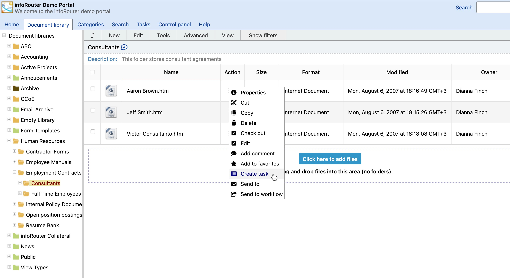
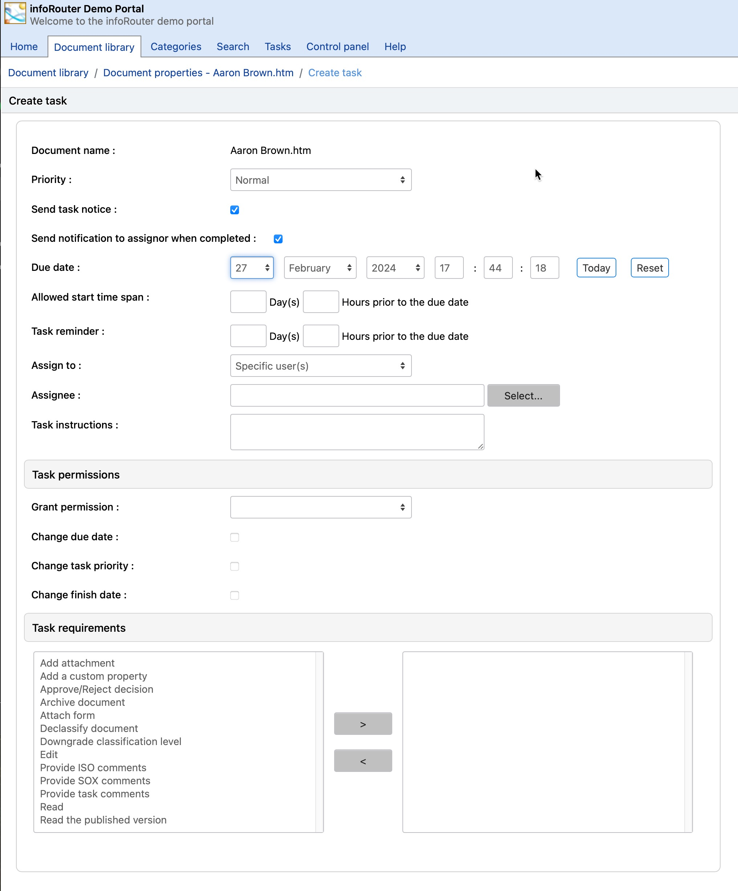

# Tasks / How to Create Tasks

Tasks are assigned at the document level and at the workflow level. This section describes how tasks are created and assigned at the document level.

To assign a task, perform the following:

1. Select the document you wish to assign a task.
2. Select the check box and click on the "Create Task" menu located in the Tools main menu. Or click the action arrow and choose "Create task".
   
3. The "Create task" window will appear.
4. Set the task priority.
5. Click the check box if you would like to send a task notice to assignees.
6. Set the Due Date for the task.
7. Set the allowed start time span.
     
    When set, this allows you to control when the task can be started. Example: You wish for the task to be performed at a later date.
8. Set the task reminder date.
9. Assign the task to a specific user.
10. Enter the task instructions.
11. Set the task permissions.
      
     The task permissions determine what the task assignee is allowed to do with the task such as postponement, task priority and the finish date.
12. Set the task requirements.
      
     The task requirements section determines what the task assignee must do before being able to mark the task as complete.

All items in this section are validated. Example: If a comment is required to complete the task, infoRouter will verify that the task assignee has supplied a comment before he/she is able to complete the task.

See Also:

[My Tasks](MyTasks.md)