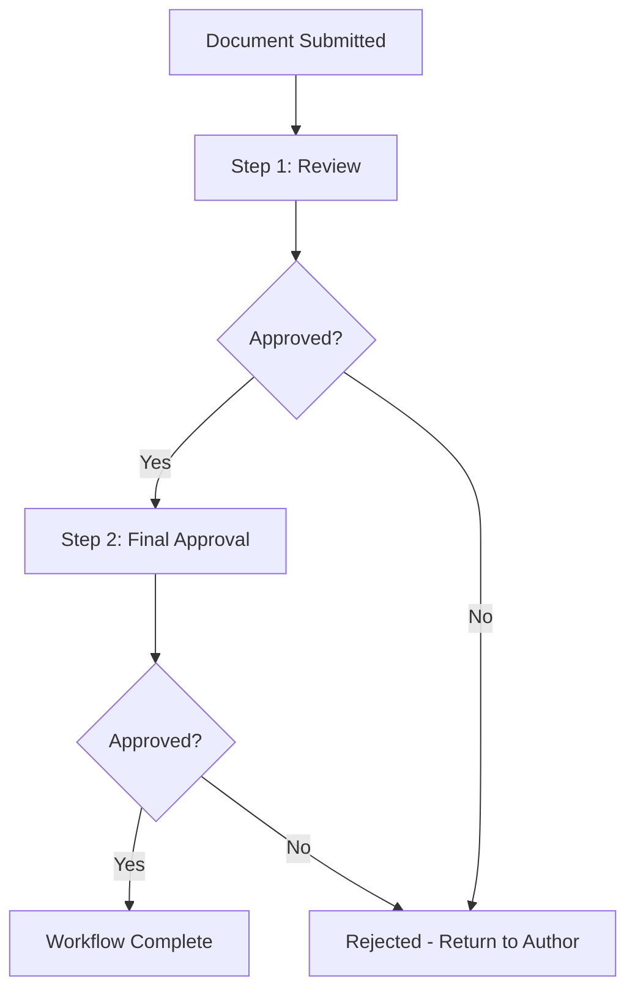

# How to Create Workflow Definitions

Define automated document routing and approval processes using workflow definitions.

---

## Who Can Create Workflows?

| Role | Can Create |
|------|------------|
| System Administrator | :material-check: Yes |
| Administrators group | :material-check: Yes |
| Library Managers | :material-check: Yes |
| Regular Users | :material-close: No |

---

## Workflow Scope

!!! info "Availability"
    Workflows are available from the folder where they're defined **and all subfolders below**. Define at the library root for library-wide availability.

---

## Step 1: Create the Workflow Definition

1. Click **Tools** → **Workflow Definitions**
2. Click **New**
3. Configure workflow settings:

| Setting | Description |
|---------|-------------|
| **Name** | Workflow display name |
| **Active Folder Path** | Where workflow is available (defaults to current location) |
| **Move To Folder** | Optional: destination folder when workflow ends |
| **On End URL** | Web service to call when workflow completes |
| **Hide** | Prevent direct submissions to this workflow |
| **Supervisor Users** | Individual users who supervise this workflow |
| **Supervisor Groups** | User groups who supervise this workflow |

4. Click **OK**

---

## Step 2: Create Workflow Steps

Each workflow needs at least one step:

1. Select the workflow you created
2. Click **Workflow Steps**
3. Click **Add Step**
4. Enter a **Step Name**
5. Click **OK**
6. Repeat for additional steps

---

## Step 3: Add Tasks to Steps

Each step needs tasks:

1. Select a step
2. Click **Add Task**
3. Configure the task:

| Setting | Description |
|---------|-------------|
| **Assignees** | Users responsible (leave blank for submitter to choose) |
| **Task Name** | Name of this task |
| **Task Rule** | How multiple assignees are handled |
| **Priority** | Task urgency |
| **Deadline** | Days until escalation to supervisor |
| **Instructions** | What assignees should do |
| **Supervisor** | Person notified if task is overdue |
| **Past Due Notification** | When supervisor receives alert |
| **Permissions** | What assignees can modify |
| **Requirements** | What must be done to complete |

4. Click **OK**

---

## Workflow Structure

---

## Documentation

| Resource | Description |
|----------|-------------|
| :material-download: [infoRouter Workflows Guide (PDF)](https://www.infoRouter.com/downloads/V80/infoRouter_Workflows.pdf) | Comprehensive workflow documentation |

---

## See Also

- [Workflows Introduction](WorkflowsIntro.md)
- [Submitting Documents to Workflow](AuthorReviews.md)
- [How to Create Tasks](HowtoCreateTasks.md)
- [How to Complete Tasks](HowtoCompleteTasks.md)