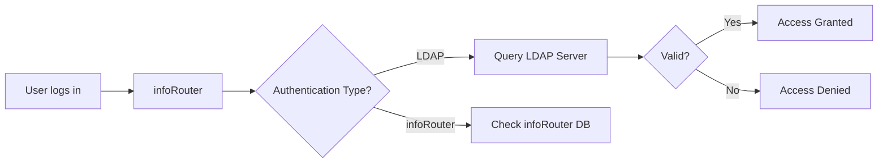

# Importing LDAP Users

Import and synchronize users from your organization's LDAP directory (Active Directory) to streamline user management.

---

## Why Import LDAP Users?

| Benefit | Description |
|---------|-------------|
| :material-clock-fast: **Time savings** | Import many users at once |
| :material-key-chain: **Single sign-on** | Users keep same password |
| :material-sync: **Synchronization** | Keep user data current |
| :material-account-group: **Consistency** | Match organization's directory |

---

## How LDAP Authentication Works

!!! info "Password Management"
    LDAP users maintain passwords in the LDAP directory, not infoRouter. They log in to infoRouter, but authentication is handled by LDAP.

---

## Requirements

| Item | Description |
|------|-------------|
| **LDAP Sync Tool** | Standalone utility must be installed |
| **LDAP Access** | Network access to LDAP server |
| **Credentials** | LDAP service account for queries |
| **Admin Rights** | System Administrator access in infoRouter |

---

## Import Process

1. System Administrator installs LDAP Synchronization Tool
2. Configure connection to LDAP server
3. Select users/groups to import
4. Run synchronization
5. Users appear in infoRouter with LDAP authentication

---

## Imported User Properties

| Property | Source |
|----------|--------|
| Username | LDAP |
| Full Name | LDAP |
| Email | LDAP |
| Password | Stored in LDAP (not infoRouter) |
| Authentication Type | LDAP (automatic) |

---

## Documentation

| Resource | Description |
|----------|-------------|
| :material-download: [LDAP Authentication Guide (PDF)](https://www.infoRouter.com/downloads/V80/infoRouter_LDAP_Authentication.pdf) | Authentication setup |
| :material-download: [LDAP Synchronization Manager (PDF)](https://www.infoRouter.com/downloads/V80/infoRouter_LDAP_Synchronization_Manager.pdf) | User import tool |

---

## See Also

- [User Authentication](Authentication.md)
- [Adding Users](AddingUsers.md)
- [Users Overview](Users.md)
- [LDAP Synchronization](LDAPSynchronization.md)