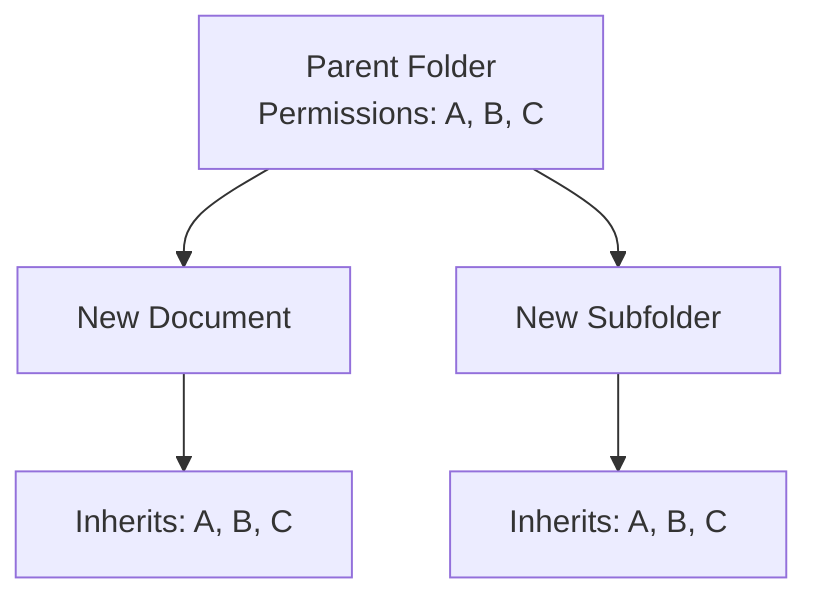

# Security Inheritance

Security inheritance allows new documents and folders to automatically receive the same permissions as their parent folder. This is the default behavior in infoRouter and simplifies security management.

---

## How Inheritance Works

When you:

- **Upload a document** to a folder → The document inherits the folder's security
- **Create a subfolder** → The subfolder inherits the parent folder's security

!!! success "Simplified Management"
    Inheritance dramatically reduces the time needed to manage security. Set permissions once at the folder level, and all new content automatically receives the same protection.

---

## Overriding Inheritance

You can override inherited security in two ways:

### During Creation

When creating folders or uploading documents, follow the wizard options to specify custom security settings. If you do this, the specified security is applied and no inheritance takes place.

### After Creation

You can also remove security inheritance from an existing folder or document by modifying its security settings directly.

---

## Best Practices

| Practice | Description |
|----------|-------------|
| :material-folder-star: **Set permissions at top levels** | Configure security on library and main folders |
| :material-arrow-down: **Let inheritance flow down** | Allow subfolders and documents to inherit |
| :material-shield-edit: **Override only when needed** | Only set custom security when different access is required |

!!! tip "Planning Security"
    Plan your folder structure with security in mind. Group documents that need the same security in the same folders to take full advantage of inheritance.

---

## See Also

- [Folder Security](FolderSecurity.md)
- [Document Security](DocumentSecurity.md)
- [Security Overview](Security.md)
- [Security Scenarios](SecurityScenarios.md)
