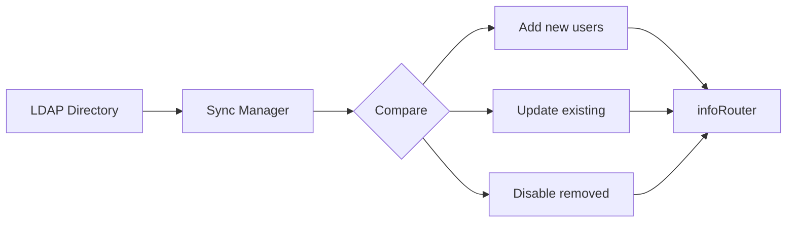

# LDAP Synchronization

Keep infoRouter user accounts synchronized with your organization's LDAP directory (Active Directory).

---

## Why Synchronize with LDAP?

| Benefit | Description |
|---------|-------------|
| :material-sync: **Automatic updates** | User changes in LDAP reflect in infoRouter |
| :material-account-off: **Deactivation sync** | Disabled LDAP accounts auto-disable in infoRouter |
| :material-account-group: **Group sync** | LDAP group memberships can be synchronized |
| :material-key: **Password sync** | Password changes in LDAP work immediately |

---

## How Synchronization Works

---

## Authentication Flow

When an LDAP user logs in:

1. User enters credentials in infoRouter
2. infoRouter queries LDAP server
3. LDAP validates the password
4. Access granted if valid

!!! info "Password Storage"
    LDAP user passwords are **never** stored in infoRouter. Authentication always goes through the LDAP server.

---

## LDAP Synchronization Manager

The LDAP Synchronization Manager is a standalone tool that:

| Function | Description |
|----------|-------------|
| **Import users** | Bring LDAP users into infoRouter |
| **Update users** | Keep user info current |
| **Sync groups** | Mirror LDAP group structures |
| **Schedule sync** | Run automatically at intervals |

---

## Requirements

| Requirement | Description |
|-------------|-------------|
| **Tool installation** | LDAP Sync Manager must be installed |
| **Network access** | Access to LDAP server |
| **Service account** | LDAP credentials for queries |
| **Admin rights** | infoRouter admin access |

---

## Documentation

| Resource | Description |
|----------|-------------|
| :material-download: [LDAP Authentication (PDF)](https://www.infoRouter.com/downloads/V80/infoRouter_LDAP_Authentication.pdf) | Setup guide |
| :material-download: [LDAP Sync Manager (PDF)](https://www.infoRouter.com/downloads/V80/infoRouter_LDAP_Synchronization_Manager.pdf) | Tool documentation |
| :material-help-circle: [infoRouter Support](https://support.inforouter.com) | Additional help |

---

## See Also

- [Importing LDAP Users](ImportingNTUsers.md)
- [User Authentication](Authentication.md)
- [Users Overview](Users.md)
- [Adding Users](AddingUsers.md)