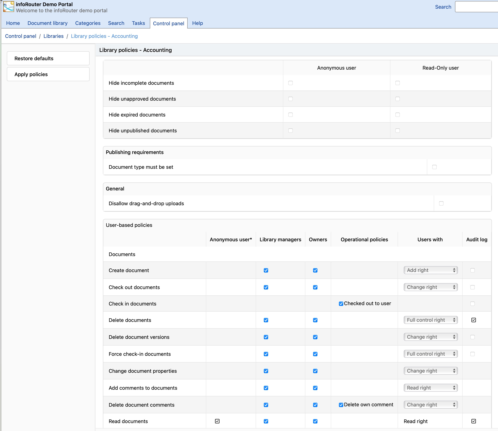

# Administrative Functions / Library Policies

Library Policies allow System Administrators and Library Managers to control how infoRouter behaves on a Library basis.

By configuring a series of policies, managers can set rules for whether a certain operation is allowed. Furthermore, it allows you to control who gets to perform these allowed operations.

Example:

You may wish to restrict the deletion of documents to a select few users in a given library. By default, the library manager, the system administrator and users with "full control" permissions are allowed to delete documents. By setting the permission drop down control to blank. You can prevent the deletion of documents by users with full control.

To view or change the Library Policies, perform the following.

1. Navigate to the "Control Panel" by clicking on the "Control Panel" tab.
2. Click on the "Libraries" link in the "Control Panel" window.
3. Select a document library from the list.
4. Click on the Library Policies link located on the left sidebar.
5. This will launch the "Library Policies" window.

Settings for Anonymous and read-only users:

This section controls the settings that apply to Anonymous and Read-only users. When set, the documents that fit the described definition will not be visible to anonymous and read-only users.

* Hide incomplete documents
* Hide unapproved documents
* Hide expired documents
* Hide unpublished documents

Publishing requirements:

This section controls the rules for publishing.

* Document type must be set

  When set, this rule enforces the document type requirement. Documents without an assigned "document type" (other than "generic") will not be published. Refer to [Publishing](Publishing.md) for more information.

General Library Policy parameters are as follows:

* Create Folders
* Create Documents
* Delete Folders
* Delete Documents
* Delete Versions
* Move Inside the Library
* Move to outside of the Library
* Change Ownership
* Read Security List
* Change Security
* Add / Change Meta Data
* Delete Meta Data
* Checkout Documents
* Check In Documents
* Force Check-In Documents
* Change Document Properties
* Change Retention Period
* Edit Document Classification
* Edit Document Completion Status
* Read Document Tasks
* Add / Remove Document Tasks
* Read Subscriber List
* Add/Remove Subscriptions
* Read Document Review Logs
* Submit / Remove Approval
* Delete Classification Logs
* Change Folder Properties
* Set Folder Rules
* Compact Folders
* Read Documents
* Read Document View Log
* Read Document SOX Logs
* Read Document ISO Logs
* Read Document Classification Logs
* Read Document Comments
* Add Comments to Documents
* Delete Document Comments
* Delete own comments

Notice that certain policies have a check box to indicate "Audit Logging". When checked, infoRouter will begin to log the selected event. An audit log of the selected events may be displayed by clicking on the "Logs & Reports" link in the document properties window.

The same link located in the "Folder Properties" window allows you to display the folder level audit logs.

The logs located in the control panel display the logs for the entire system.

