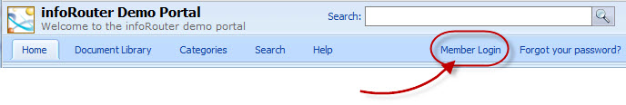
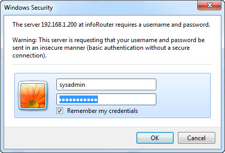

# Getting Started / How to Login to infoRouter

To log in as an authenticated user, click on the link located on your portal labeled "Member Login". If you do not have a User Name and Password, please contact the infoRouter System Administrator.

At the pop-up login screen, enter the following:

1. Enter your User Name
2. Enter your Password

If this is your first time logging into infoRouter, infoRouter may prompt you to change your password.

If you would like infoRouter to remember your password, check the "Remember My Password" check box. The next time you use infoRouter, your browser will remember your credentials. You must have the "support for cookies enabled" feature set in your browser settings for this to work.

Anonymous Access:

In the Anonymous mode, infoRouter looks quite different and many of the most powerful functions are disabled. However, you can access "Anonymous Libraries" without having to log in.