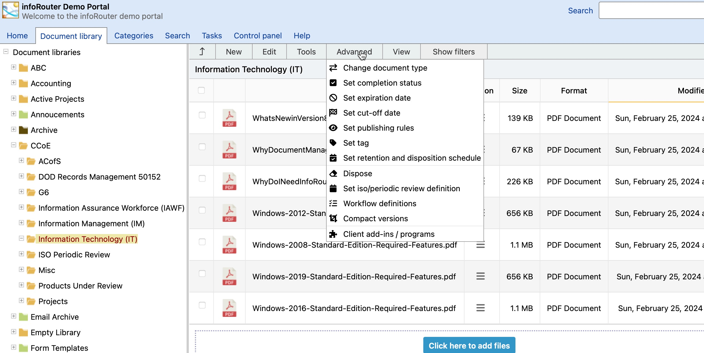

# The Tools Menu

Change document type:

This menu item launces a window in which you can chnage the document type. Please note that some document types require the entry of custom property values.

Set Completion Status:

This menu item launces a window in which you can set the completion status of documents. Setting a completion status for documents will prevent documents from being edited.

Set expiration date:

This menu item allows you to set an expiration date for the selected documents.

Set cutoff date:

This menu item allows you to set a cutoff date for a document or folder. Setting a cutoff date triggers a Retention and Disposition Schedule.

Set publishing rules:

This menu item allows you to set publishing rules for the selected document. The selected version will be displayed/downloaded when a user clicks on the document.

Set ISO Periodic Review Definition:

Using this window, you may create a scheduled process where documents are reviewed based on a set schedule by users or by a group of users in a workflow.

Set publishing rules:

This menu item allows you to set the publishing rules for a document. Using this feature, you can decide which version of the document gets published to users.The version that gets published can be different than the latest version.

Set Tag:

This menu allows users to mark the selected documents with a specific tag. The tag will be applied to the specific version of the document at time of tag application.

Set Retention and Disposition Schedule:

This menu item launces a window in which you can set a retention schedule for selected documents and folders. Setting a retention schedule will protect documents and folders from accidental deletion.

Dispose:

This menu item allows authorized users to properly delete a document once the Retention and Disposition Schedule allows this action.

Set ISO Periodic Review Definition:

Using this window, you may create a scheduled process where documents are reviewed based on a set schedule by users or by a group of users in a workflow.

Workflow Definitions:

This menu launches the "Workflow Definitions" window for the active document library

Compact Versions:

This menu item launches the "Compact Versions" window.   
Using this window, you get rid of unwanted document versions.

Client Add-Ins / Programs:

This menu item launches the "Client Add-Ins and Programs" window.
  
 This window provides a list of available client-side tools such as the Import Export Tool, the infoRouter Add-in for MS Office.

The system administrator may disable this menu to prevent users from downloading and installing these programs. If you do not see this menu please ask your administrator about it.