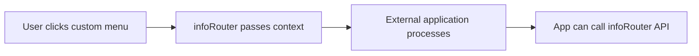

# Custom Menus

Create custom menu items to integrate infoRouter with external applications and third-party tools.

---

## Overview

Custom menus enable integration between infoRouter and:

- Home-grown applications
- Third-party tools
- External systems

---

## How It Works

### Information Passed

When a custom menu is launched, infoRouter automatically passes:

| Information | Description |
|-------------|-------------|
| :material-folder: **Current folder** | Active folder context |
| :material-folder-multiple: **Selected folders** | All selected folders |
| :material-file-multiple: **Selected documents** | All selected documents |
| :material-account: **User information** | Current user details |

---

## Integration

!!! tip "Web Services API"
    External applications can communicate back to infoRouter using the Web Services API for bi-directional integration.

---

## Documentation

:material-book-open: [Adding Custom Menus Guide](https://support.inforouter.com/documentation/v80/adding-custom-menus.md)

---

## See Also

- [The Menu System](TheMenuSystem.md)
- [Application Settings](ApplicationSettings.md)