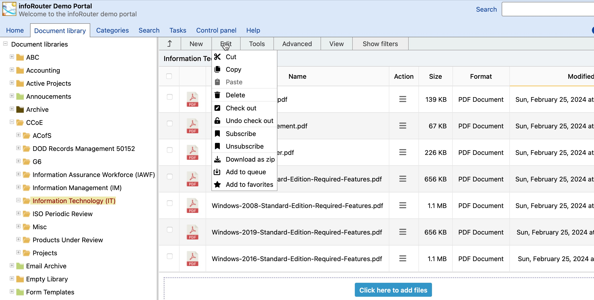

# The Menu System / Edit Menu

Cut:

This menu creates a copy of the selected documents and folders. The copied items are placed in the clipboard. When the "Paste" menu item is clicked, the clipboard items are copied into the target folder, the selected items are removed from their original location and finally the clipboard is emptied.

Copy:

This menu creates a copy of the selected documents and folders. The copied items are placed in the clipboard. When the "Paste" menu item is clicked, the clipboard items are copied into the target folder, the clipboard is emptied. The selected items remain in their original location.

Paste:

This menu item copies the contents of the clipboard into the current folder.

Delete:

This menu item deletes the selected documents and folders.

Check Out:

This menu item checks out the selected documents. If any of the selected items are folders, the contents of the folder are also checked out.

Undo Check Out:

This menu item performs an "Undo Check Out" operation on the selected documents and folders.

Subscribe:

This menu item creates a subscription record for the selected items for the current user.

Un-Subscribe:

This menu item unsubscribes you from the selected documents.

Download as Zip:

This menu item, creates a zip file of the selected documents and folders and downloads the zip file.

Add to Queue:

This menu item places a shortcut of the selected documents and folders into the Download Queue for later downloading.

Add to Favorites:

This menu item adds the selected documents and folders into the Favorites list.