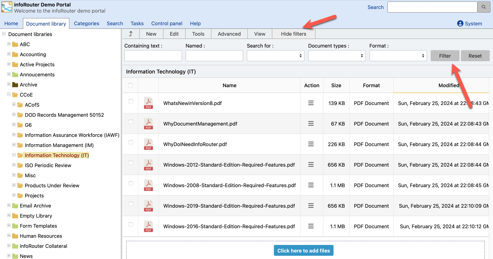

# The Menu System / Filter Menu

The Filter menu displays the following prompts in the main document view section:

Containing Text:

This prompt allows you to search for documents within the folder by content.

Named:

This prompt allows you to search for documents within the folder by name.

Search for:

This prompt allows you to search by type (Folders or Documents). Leaving this blank will allow you to search for both.

Document Type:

This prompt allows you to search for documents by the document type assigned to them.

Format:

This prompt allows you to search for documents within the folder by format (Images, videos, Office documents etc.).

Simply specify the desired entries in the relevant filter prompts and click on the "Filter" button to filter the document list.