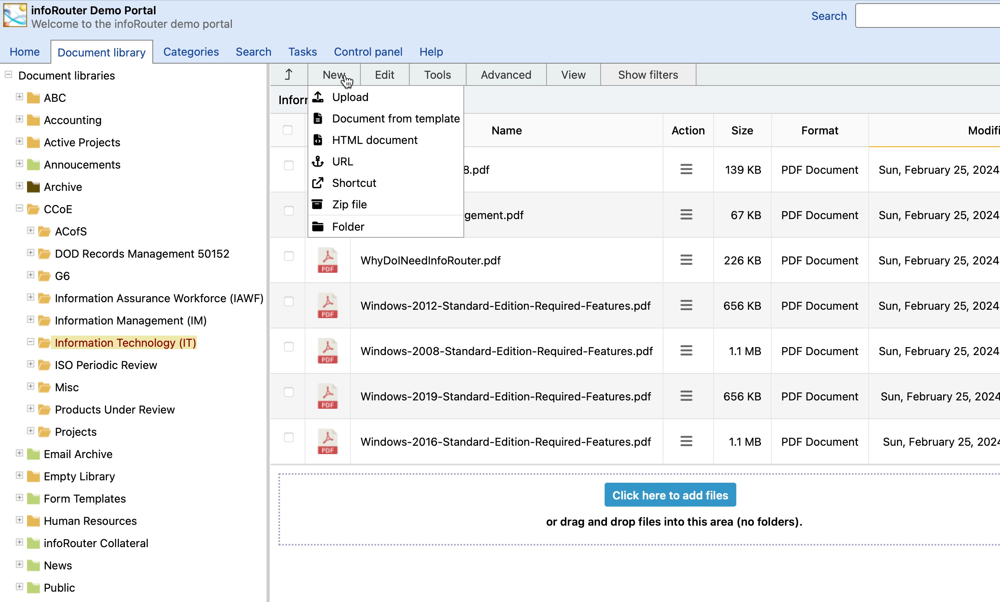

# The Menu System / New Menu

Upload:

This menu executes a window that allows you to upload an existing document into infoRouter. For more information on this topic, navigate to [Uploading Documents](UploadDocument.md)

Document from Template:

This menu item executes a window that allows you to pick from a list available "Form Templates". For more information on this topic, navigate to  [Using Form Templates](UsingFormTemplates.md)

HTML Document

This menu item executes a built-in Editor window that allows you to create a document directly inside infoRouter. The "Editor" includes all the basis text editing and formatting functions and the resulting output is saved in HTML format.

URL:

This menu item executes a window that allows you to create a URL document. For more information on this topic, navigate to [URLs](URLs.md)

Shortcut:

This menu item executes a window that allows you to create a Shortcut document.
  
 For more information on this topic, navigate to [Document Shortcuts](DocumentShortcuts.md)

Zip File:

This menu item allows you to upload a ZIP file. Please note that the zip file you upload will automatically be expanded on the server.
  
 For more information on this topic, navigate to [Using Zip Uploads](UsingZipUpload.md)

Folder:

This menu item executes a window that allows you to create a Folder. For more information on this topic, navigate to [Creating Folders](CreateFolder.md)