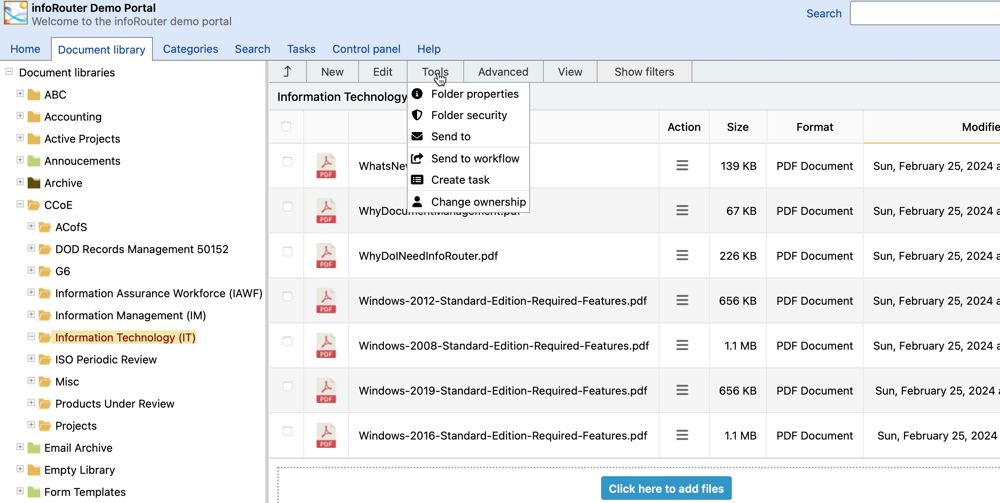

# The Tools Menu

Folder Properties:

This menu item launches the "Folder Properties" window.

Folder Security:

This menu item launches the "Folder Security" window. Please note that only authorized users can see or edit the folder security definitions screen.

Send To:

This menu item launches a window that allows you to e-mail the selected documents and folder to internal and external users.

Send to Workflow:

This menu item launches a window that displays a list of library wide "Workflow Definitions". You can choose from one of the items in the list and submit your document to the selected workflow.

Create Task:

This menu item launches the "Create Task" window.
  
 Using this menu, users may assign other users tasks based on the selected documents.

Change Ownership:

This menu item launches the "Change Ownership" window.   
Using this window, you may change the ownership of documents and folders.