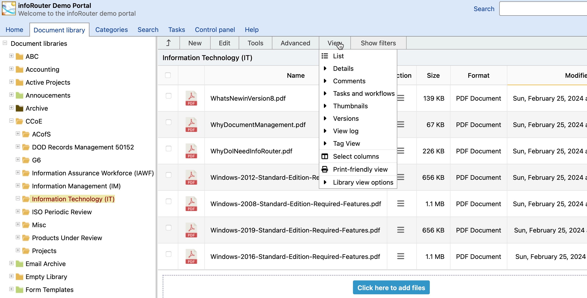

# The Menu System / View Menu

infoRouter allows you to view the contents of your folders in various ways.
  
 To change your view type, click on the "View" Menu and select a view type.
  
 Notice, the current view type will be marked with an icon to the left to indicate that this view type is active.

Each view type displays different types of information about documents in the folder.

List:

This view is a simple document listing. No additional information is displayed.

Details:

This view provides additional details about the folder's contents, including document descriptions and any associated documents.

Comments:

This view displays all the comments added to each document.

Workflow Status:

This view displays information about the review status of a document. It displays information about each reviewer assigned and their votes on the status of a document.

Thumbnails:

This view is used for folders containing images. It displays a small thumbnail view of each image, allowing you to identify the image visually.

Versions:

This view displays all available versions of a document. You can select and view previous versions of any document.

View Log:

This view displays a log of users who have viewed each document.

Tag View:

This view displays all tags applied to the documents in a given folder.

Select Columns:

This menu item displays a window that allows you to select from a complete list of fields that you wish to display in the document list.

For more information on this screen, click here [Select Columns](SelColumns.md).

Print Friendly View:

This view displays a printer friendly view eliminating buttons and extra graphics for easy printing.

Library View Options:

This view displays a window where you can elect to see Hidden Libraries and Archive Libraries in the navigation tree.