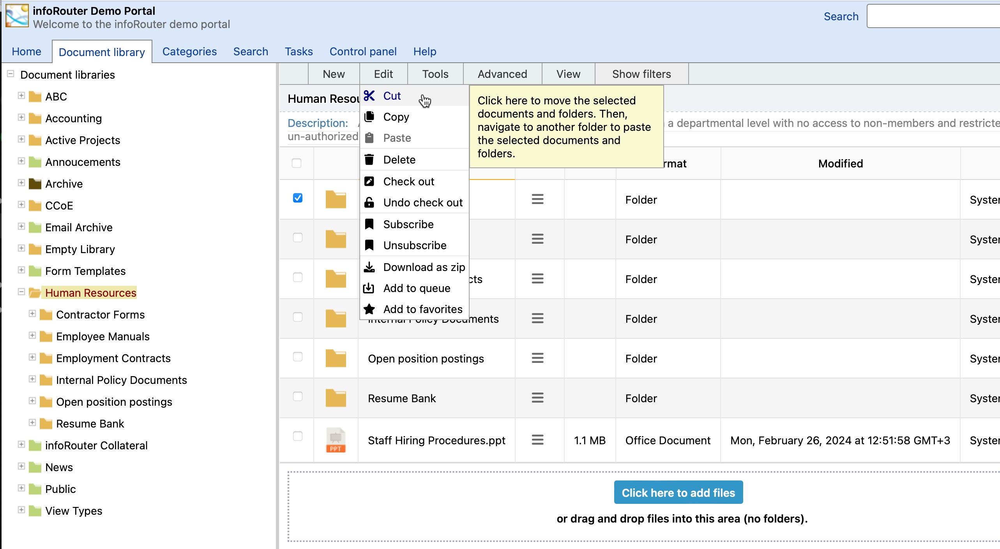
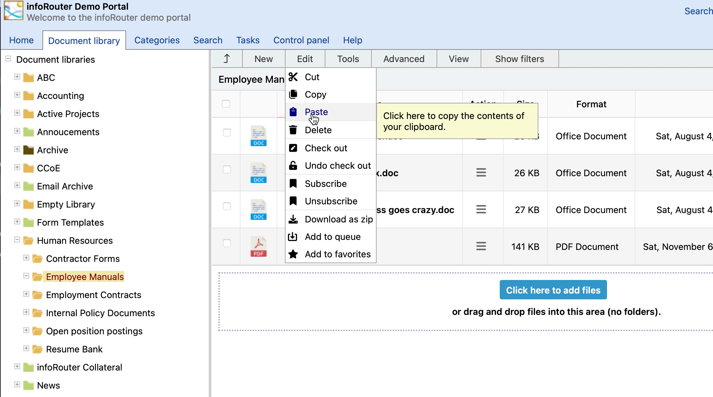

# Moving Folders

When you move a folder, the entire contents — including all subfolders and documents — are moved to the new location.

---

## What Gets Preserved

| Setting | Preserved? |
|---------|------------|
| Folder Rules | :material-check: Yes |
| Custom Properties | :material-check: Yes |
| Security Settings | :material-check: Yes* |

!!! warning "Security Across Libraries"
    *Security settings are preserved, but may become unusable when moving folders across libraries.

---

## Cross-Library Move Example

Consider this scenario:

1. Jim has **Full Control** on a folder
2. Mary moves the folder to a different library where Jim is **not a member**
3. **Result:** Jim can no longer access the folder or its contents
4. **If** Jim is made a member of the new library → Jim regains access
5. **If** the folder is moved back → Jim's original access is restored

---

## How to Move a Folder

1. Check the box next to the folder you want to move
2. Go to **Edit** → **Cut**

    

3. Navigate to the destination location
4. Go to **Edit** → **Paste**

    

5. Confirm the action when prompted

---

## Required Permissions

| Location | Required Permission |
|----------|-------------------|
| **Source folder** | Full Control (you're deleting from here) |
| **Destination folder** | Add or Change (you're creating here) |

---

## Restrictions

!!! note "Libraries Cannot Be Moved"
    Root-level folders (Libraries) cannot be moved. Only subfolders within libraries can be moved.

---

## See Also

- [Folder Security](FolderSecurity.md)
- [Document Libraries](Libraries.md)
- [Security Inheritance](Inheritance.md)
