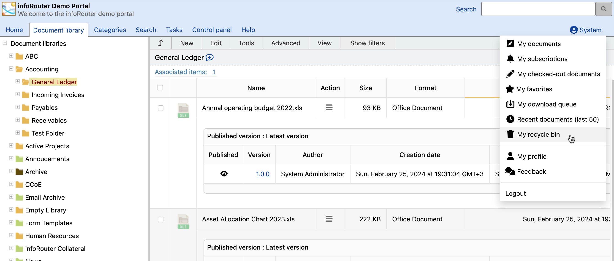
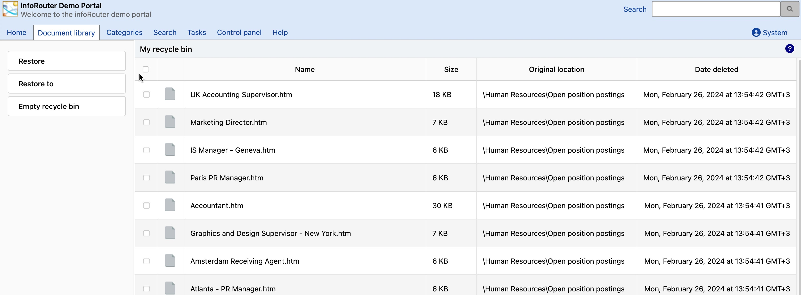

# My Recycle Bin

Deleted documents are placed in the Recycle Bin, allowing you to recover accidentally deleted files.

---

## How It Works

Every infoRouter user has their own personal Recycle Bin that contains documents they have deleted.

!!! info "Privacy"
    You can only see the contents of **your own** Recycle Bin. The System Administrator can search through all Recycle Bins to recover documents.

---

## Who Can Recover Documents?

| Scenario | Who Can Recover |
|----------|-----------------|
| You deleted the document | You or System Administrator |
| Another user deleted your document | The user who deleted it or System Administrator |

---

## Recovering a Document

1. Click **My Recycle Bin** under your profile

    

2. The Recycle Bin window displays all documents you've deleted

    

3. Select the document you wish to recover
4. Click **Restore**
5. Choose a folder to restore the document to
6. Confirm your action

!!! success "Full Recovery"
    Restored documents include all original information, including version history.

---

## Emptying the Recycle Bin

Depending on System Administrator settings, you may see an **"Empty Recycle Bin"** button.

!!! warning "Still Recoverable"
    Even after emptying your Recycle Bin, documents are moved to the **System Recycle Bin**. The System Administrator or members of the Administrators group can still recover these documents.

---

## See Also

- [Personal Dashboard](PersonalDashboard.md)
- [Manage Recycle Bin](ManageRecycleBin.md)
- [Working with Documents](Documents.md)
