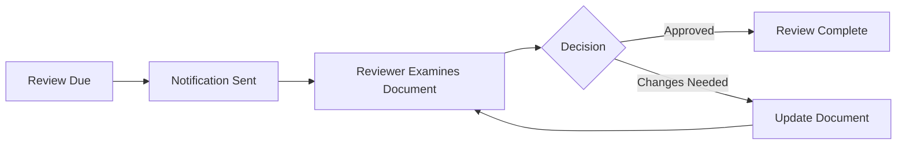

# Periodic Reviews

Periodic reviews ensure documents are regularly examined for accuracy, compliance, and continued relevance. This is essential for ISO certification and regulatory compliance.

---

## Overview

Periodic reviews automatically schedule document reviews at defined intervals. When a review is due, assigned reviewers receive notifications and must complete the review process.

---

## Review Types

| Type | Description |
|------|-------------|
| :material-certificate: **ISO Review** | Reviews for ISO certification compliance |
| :material-shield-check: **SOX Review** | Sarbanes-Oxley compliance reviews |
| :material-calendar-clock: **Custom Review** | Organization-defined review schedules |

---

## Setting Up Periodic Reviews

1. Navigate to the document or folder
2. Click **Action** > **Set ISO Periodic Review Definition**
3. Configure the review schedule:
   - Review frequency (monthly, quarterly, annually)
   - First review date
   - Assigned reviewers
4. Click **OK**

---

## Review Schedule Options

| Setting | Description |
|---------|-------------|
| **Frequency** | How often reviews occur |
| **Start Date** | When the first review is due |
| **Reviewers** | Users or workflow assigned to review |
| **Reminder Days** | Days before due date to send reminders |

---

## The Review Process

---

## Review Notifications

Reviewers receive notifications:

- When a review becomes due
- Reminder notifications before the due date
- Escalation notices if reviews are overdue

---

## Tracking Reviews

View review status and history:

1. Open **Document Properties**
2. Click **Logs & Reports** in the sidebar
3. Select **ISO Review Log** or **SOX Review Log**

---

## See Also

- [Introduction to Workflows](WorkflowsIntro.md)
- [Task Notifications](TaskNotifications.md)
- [Document Auditing](DocumentAuditing.md)
