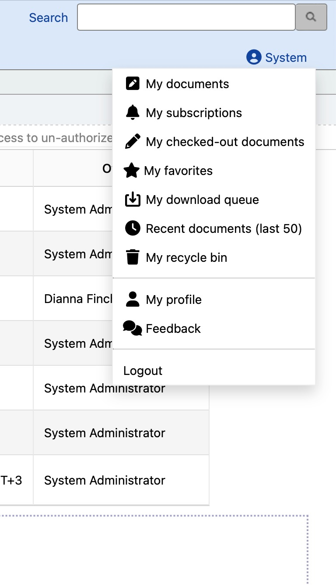

# User Profile / Introduction

The infoRouter "User profile" is a special area that contains user specific links.

These links are shortcuts designed to provide list of documents, tasks etc.

To navigate to your "Personal Dashboard", simply click on the tab labeled with your name and last name.

For more information on this topic, please review the sub-topics under the Personal Dashboard topic.

See also:

[My checked out documents](MyCheckedOutDocuments.md)

[My Documents](MyDocuments.md)

[My Recycle Bin](MyRecycleBin.md)

[My Subscriptions](MySubscriptions.md)

[My Tasks](MyTasks.md)

[My Favorites](MyFavorites.md)

[My Profile](UserProfile.md)