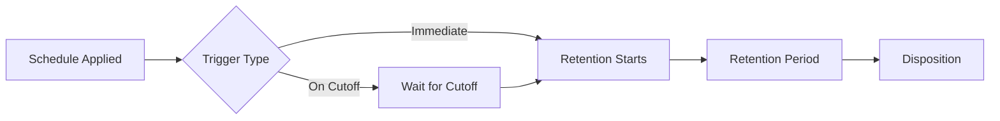

# Retention and Disposition Schedules

Create and manage schedules that define how long documents are retained and what happens when retention ends.

---

## Who Can Manage Schedules?

| Role | Access |
|------|--------|
| R&D Managers | :material-check: Create and edit schedules |
| System Administrator | :material-check: Full access |
| Other Users | :material-close: Cannot manage |

---

## Creating a New Schedule

1. Navigate to the **Control Panel**
2. Click **Retention and Disposition Schedules**
3. Click **New** in the left menu
4. Configure schedule settings:

| Setting | Description |
|---------|-------------|
| **Schedule Name** | Descriptive name |
| **Retention Period** | How long to retain |
| **Trigger** | When retention starts |
| **Disposition Action** | What happens at end |
| **Assignee** | Who handles disposition |

5. Click **OK**

---

## Assigning Schedules to Documents

1. Open document **Properties**
2. Scroll to the **Retention** section
3. Select a Retention and Disposition Schedule
4. Save changes

---

## Retention Triggers

| Trigger | When Retention Starts |
|---------|----------------------|
| **Immediate** | As soon as schedule is applied |
| **On Cutoff** | When document enters cutoff state |

!!! info "Cutoff State"
    When a document is in **cutoff** state, it cannot be checked out for edits. This is similar to being marked as "complete." Retention begins at this point if the schedule uses cutoff triggering.

---

## Schedule Lifecycle

---

## Best Practices

!!! tip "Scheduling Guidelines"
    - Use descriptive schedule names
    - Match schedules to regulatory requirements
    - Test schedules before production use
    - Document disposition procedures

---

## See Also

- [Retention Overview](Retention.md)
- [Document Retention](DocumentRetention.md)
- [Folder Retention](FolderRetention.md)
- [Disposition](Disposition.md)