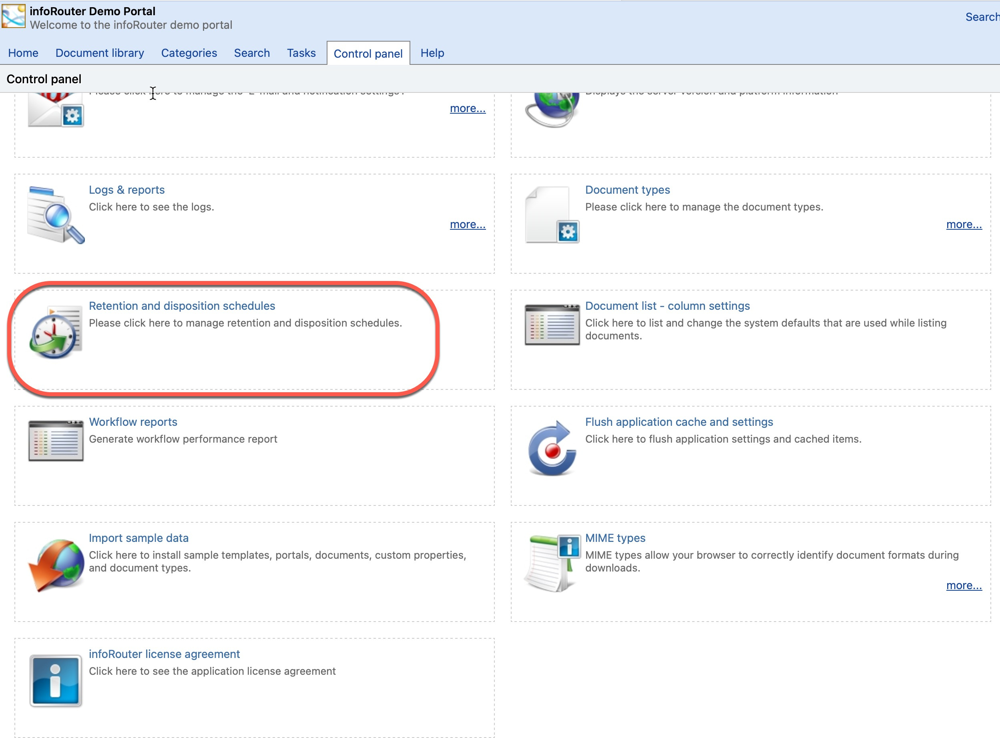
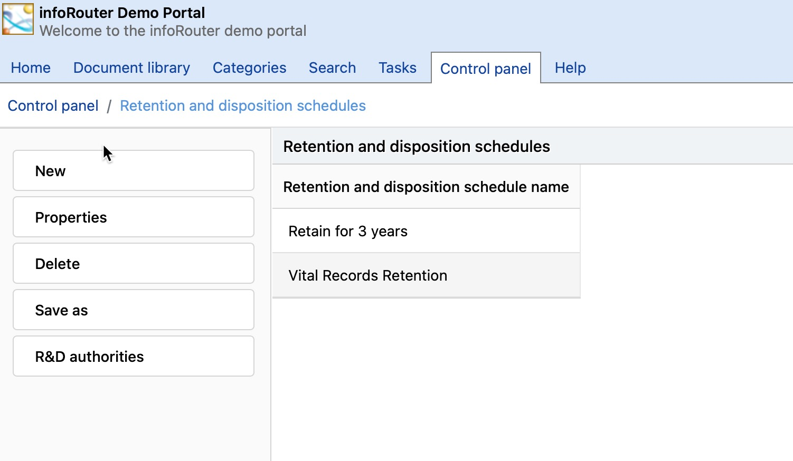
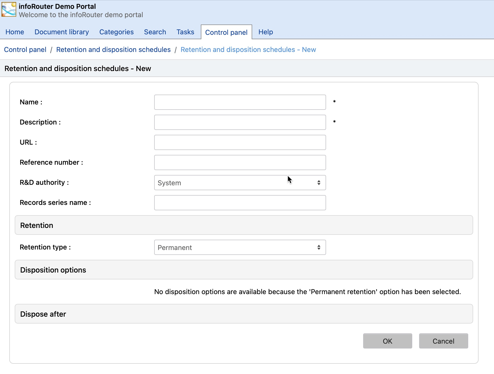

# Retention & Disposition Schedules / Retention and Disposition Schedules

Retention and Disposition Schedules can only be created and edited by members of a special system user group called RD Managers.

To create a new Retention and Disposition Schedule, perform the following steps:

1. Navigate to the infoRouter Control Panel.
2. Click on the link labeled Retention and Disposition Schedules.
3. Click New from the left menu to create a new schedule.
4. Follow the on-screen instructions
5. Click "OK".

You can assign Retention and Disposition Schedules to documents using the Document Properties Screen by scrolling down to the Retention section.
Note that simply assigning a Retention Schedule to a document does not automatically take effect. Retention Schedules are either triggered when the document is triggered or they are triggered
when the document is "Cutoff".

When a document is in a cutoff state, it cannot be checked out for edits. It is similar to being marked as "complete".
So, depending on the retention schedule, a retention on a document can either start immediately as it is applied or the retention waits until the document is cutoff.