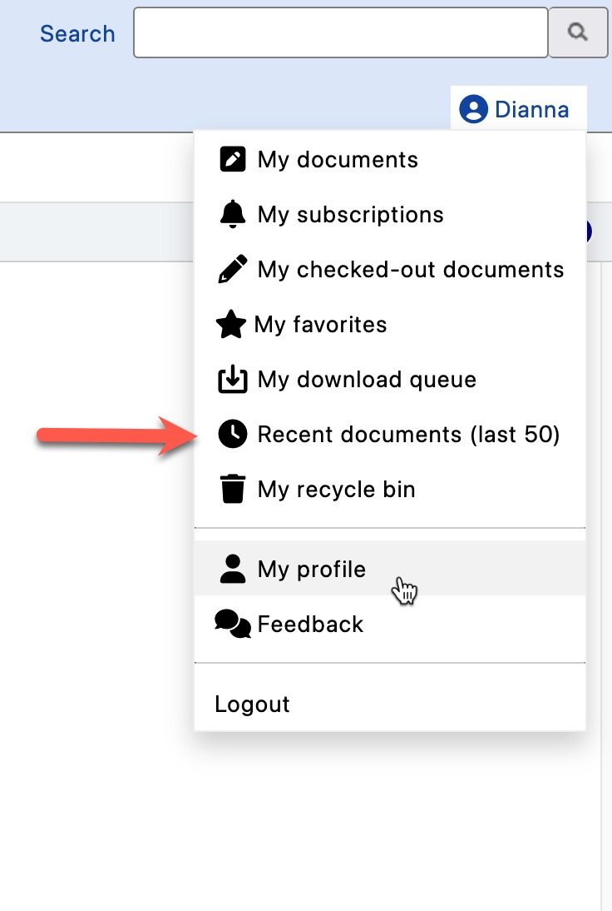

# Recent Documents

The **Recent Documents** view displays the last 25 documents you've worked on, providing quick access to your recent activity.

---

## Accessing Recent Documents

1. Go to your **Personal Dashboard** (click on your name)
2. Select **Recent Documents**

---

## What's Included

This view shows documents you've recently:

- Viewed
- Edited
- Checked out
- Checked in

!!! tip "Quick Resume"
    Use Recent Documents to quickly return to files you were working on without navigating through folders.

---

## Features

| Feature | Description |
|---------|-------------|
| **Flat list** | All recent items in one view |
| **Last 25 documents** | Most recent activity shown |
| **Quick access** | Click to open any document |

---

## See Also

- [Personal Dashboard](PersonalDashboard.md)
- [My Documents](MyDocuments.md)
- [My Favorites](MyFavorites.md)
- [Viewing Documents](ViewDocument.md)
