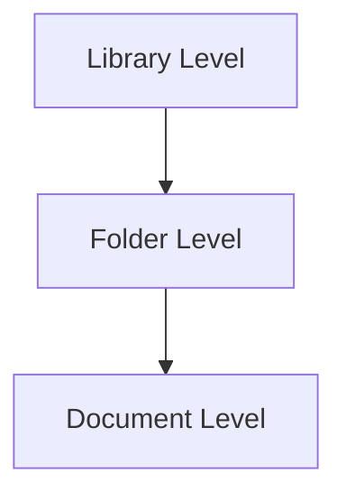

# Security Overview

infoRouter provides a powerful and flexible security environment. Security can be administered at multiple levels to protect your documents and control access.

!!! info "Familiar Model"
    infoRouter's security model is similar to Microsoft Windows NTFS security, making it intuitive for system administrators.

---

## Security Levels

infoRouter security operates at three distinct levels:

### Level 1: Library Security

Libraries are isolated environments where groups of users work and collaborate.

| Feature | Description |
|---------|-------------|
| **Membership Required** | Only library members can see or access a library |
| **Complete Isolation** | Non-members cannot even see that a library exists |
| **Policy Control** | Library policies determine what actions users can perform |

:material-arrow-right: Learn more: [Library Policies](LibraryPolicies.md)

---

### Level 2: Folder Security

Within a library, access to folders is controlled by folder-level permissions.

| Permission Level | Capabilities |
|-----------------|--------------|
| No Access | Cannot access the folder |
| List | Can see folder contents only |
| Read | Can view documents |
| Add | Can create documents |
| Add & Read | Can create and view documents |
| Change | Can modify documents |
| Full Control | Complete access |

:material-arrow-right: Learn more: [Folder Security](FolderSecurity.md)

---

### Level 3: Document Security

Individual documents can have their own permission settings, providing the most granular level of control.

| Permission Level | Capabilities |
|-----------------|--------------|
| No Access | Cannot access the document |
| Read | Can view the document |
| Change | Can modify the document |
| Full Control | Complete access including security changes |

:material-arrow-right: Learn more: [Document Security](DocumentSecurity.md)

---

## Additional Resources

| Resource | Description |
|----------|-------------|
| :material-download: [LDAP Authentication Guide (PDF)](https://www.infoRouter.com/downloads/V80/infoRouter_LDAP_Authentication.pdf) | Configure LDAP/Active Directory authentication |
| :material-download: [LDAP Synchronization Manager (PDF)](https://www.infoRouter.com/downloads/V80/infoRouter_LDAP_Synchronization_Manager.pdf) | Synchronize users and groups from LDAP |

---

## See Also

- [Library Policies](LibraryPolicies.md)
- [Folder Security](FolderSecurity.md)
- [Document Security](DocumentSecurity.md)
- [User Authentication](Authentication.md)
- [Security Scenarios](SecurityScenarios.md)
