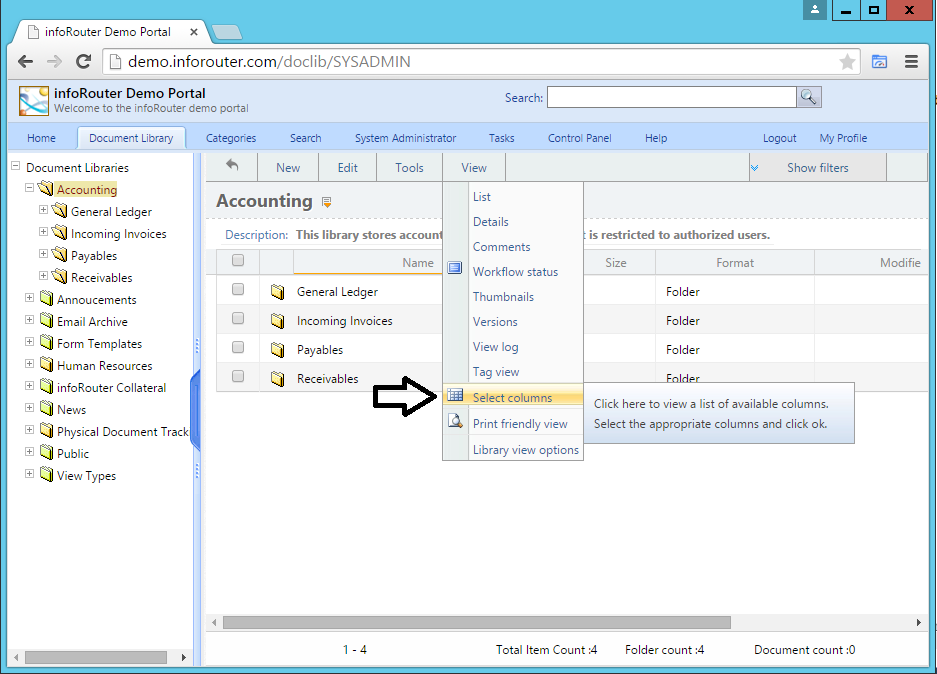
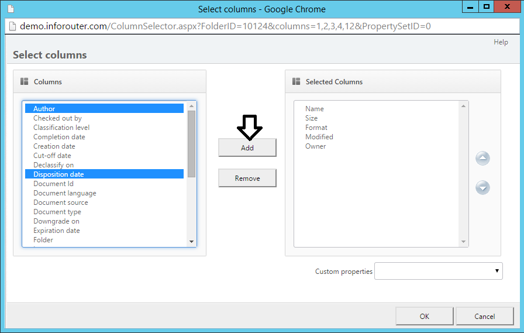

# Selecting Columns to View

Customize the Documents Panel by selecting which columns to display. You can show all available fields or only the ones most relevant to your work.

!!! success "Persistent Settings"
    Your column selections are remembered by infoRouter and will remain in effect until you change them.

---

## How to Select Columns

### Step 1: Navigate to a Folder

Open any folder in the Document Library where you want to customize the column view.

### Step 2: Open Column Selector

Go to **View** → **Select Columns** from the menu.

### Step 3: Choose Your Columns

In the column selector window:

1. Browse the list of available columns on the left
2. Select the columns you want to display
3. Click the **Add** button to add them to your view
4. Use the **Remove** button to hide columns you don't need
5. Click **OK** to apply your changes

---

## Available Columns

Common columns you can display include:

| Column | Description |
|--------|-------------|
| **Name** | Document file name |
| **Size** | File size |
| **Type** | Document type/extension |
| **Modified** | Last modification date |
| **Created** | Creation date |
| **Author** | Document author |
| **Version** | Current version number |
| **Status** | Check-out status |
| **Custom Properties** | Any custom metadata fields |

---

## See Also

- [The Work Area](WorkArea.md)
- [Working with Documents](Documents.md)
- [Custom Properties](CustomPropertyIntro.md)