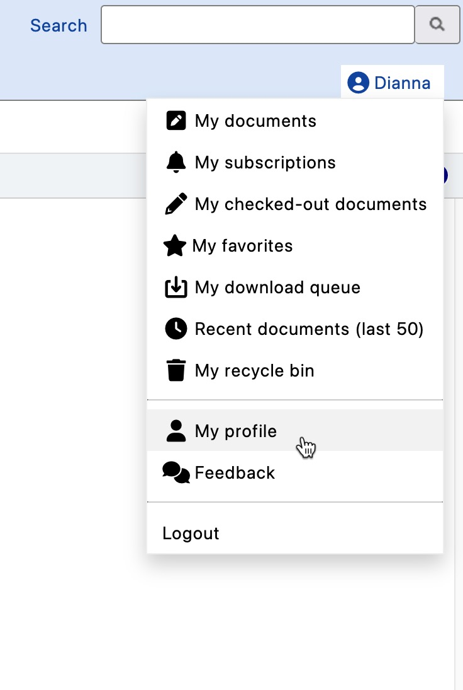
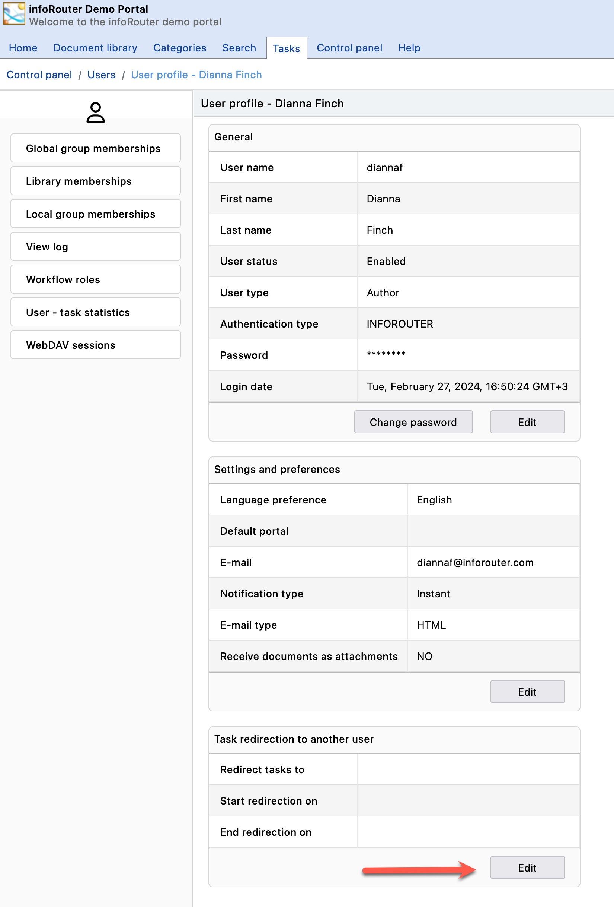
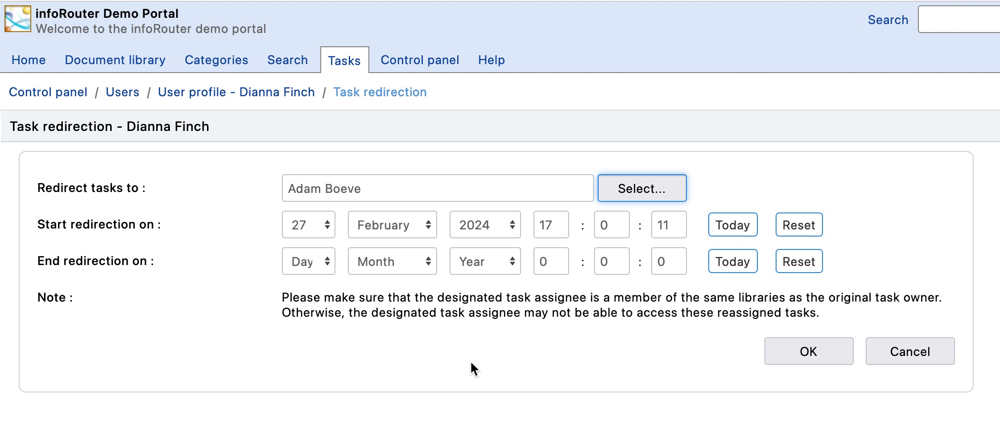

# Task Redirection

## [Getting Started](#c1)

[Introduction](intro.aspx)

[Basic Concepts](BasicConcepts.aspx)

[Getting Started](GettingStarted.aspx)

[How to access infoRouter](AccessingInfoRouter.aspx)

[How to Login to infoRouter](Login.aspx)

[The infoRouter Work Area](WorkArea.aspx)

[Selecting columns to view](SelColumns.aspx)

## [The Menu System](#c2)

[The Menu System Introduction](TheMenuSystem.aspx)

[The New Menu](MenuNew.aspx)

[The Edit Menu](MenuEdit.aspx)

[The Tools Menu](MenuTools.aspx)

[The Advanced Menu](MenuAdvanced.aspx)

[The View Menu](MenuView.aspx)

[The Filter Menu](MenuFilter.aspx)

[Custom Menus](MenuCustom.aspx)

## [Working with Documents](#c3)

[Introduction](Documents.aspx)

[Viewing Documents](ViewDocument.aspx)

[Editing documents](EditingDocuments.aspx)

[Checking in documents](CheckIn.aspx)

[Checking out documents](CheckOutScreen.aspx)

[How to create documents](HowtoCreateDocuments.aspx)

[Creating documents](CreatingDocuments.aspx)

[Creating documents using WebDAV](WebdavDocuments.aspx)

[Creating documents with Zip Uploads](UsingZipUpload.aspx)

[Creating documents with Form Templates](UsingFormTemplates.aspx)

[Version control](VersionControl.aspx)

[Publishing](Publishing.aspx)

[Document Types](DocumentTypes.aspx)

[Deleting documents](DeleteDocument.aspx)

[Recovering deleted documents](RecycleBin.aspx)

[Archiving documents](ArchivingDocuments.aspx)

[Completing documents](CompletingDocuments.aspx)

[Copying and moving documents](CopyMoveDocuments.aspx)

[Classifying and de-classifying documents](ClassDeClassDocuments.aspx)

[Tagging documents](TaggingDocuments.aspx)

[Document properties](DocumentProperties.aspx)

[Distributing documents](SendTo.aspx)

[Document comments](DocumentComments.aspx)

[Document keywords](DocumentKeywords.aspx)

[Document associations](Associations.aspx)

[Shortcuts](DocumentShortcuts.aspx)

[URLs](URLs.aspx)

[E-mail documents](EmailDocuments.aspx)

[Document ownership](DocOwnership.aspx)

[Document thumbnails](Thumbnails.aspx)

[Download Queue](Downloadqueue.aspx)

[Periodic (ISO) Reviews](PeriodicReviews.aspx)

[Upload Document](UploadDocument.aspx)

[Audit Log Document](AuditLogDocument.aspx)

## [Working with Folders](#c4)

[Introduction](Folders.aspx)

[Viewing folders](ViewFolder.aspx)

[Creating folders](CreateFolder.aspx)

[Deleting folders](DeleteFolder.aspx)

[Setting folder rules](FolderRules.aspx)

[Folder properties](ViewFolderProperties.aspx)

[Compacting folders](CompactFolder.aspx)

[Moving folders](MovingFolders.aspx)

[Audit Log](AuditLog.aspx)

[Audit Log folder](AuditLogFolder.aspx)

[Folder view styles](FolderViewStyles.aspx)

[Folder statistics](FolderStats.aspx)

[Folder view styles](MenuView.aspx)

[Automatic prompts](FolderPrompts.aspx)

[Folder ownership](FolderOwnership.aspx)

## [Working with Form Templates](#c5)

[Introduction](FormTemplatesIntro.aspx)

[Creating form templates](CreatingFormTemplates.aspx)

[Deleting form templates](DeletingFormTemplates.aspx)

[Using form templates](UsingFormTemplates.aspx)

[Usage scenarios](FormTemplateScenarios.aspx)

[Form rendering options](RenderingOptions.aspx)

## [infoRouter Portals](#c6)

[Introduction](PortalsIntro.aspx)

[How to create portals](CreatingPortals.aspx)

[Designing portals](DesigningPortals.aspx)

[Portal gadgets](Gadgets.aspx)

[Portal Administrators](PortalAdmins.aspx)

[Setting Up portal administrators](SettingUpPortalAdmins.aspx)

[Examples and usage scenarios](PortalScenarios.aspx)

[Customizing Portals - Personalization](CustomizingPortals.aspx)

## [Searching for documents and folders](#c7)

[Searching](searchbook.aspx)

[Content Search](ContentSearch.aspx)

[Advanced Search](AdvancedSearch.aspx)

[Searching with Saved Searches](UsingSavedSearches.aspx)

[Searching with Custom Properties](SearchingCustomProperties.aspx)

[Ignored Keywords](IgnoredKeywords.aspx)

[Creating Saved Searches](CreatingSavedSearches.aspx)

[Categories](Categories.aspx)

[Creating Categories](CreatingCategories.aspx)

[Editing Categories](EditingCategories.aspx)

[Deleting Categories](DeletingCategories.aspx)

[Category Administration](CategoryAdministrators.aspx)

## [User Profile](#c8)

[Introduction](PersonalDashboard.aspx)

[My Documents](MyDocuments.aspx)

[My Subscriptions](MySubscriptions.aspx)

[My Checked Out Documents](MyCheckedOutDocuments.aspx)

[My Favorites](MyFavorites.aspx)

[My Tasks](MyTasks.aspx)

[My Download Queue](Downloadqueue.aspx)

[My Recycle Bin](MyRecycleBin.aspx)

[My Profile](UserProfile.aspx)

[Recent Documents](RecentDocuments.aspx)

## [Custom Property Sets (Meta Data)](#c9)

[Introduction](CustomPropertyIntro.aspx)

[Creating Custom Property Sets](HowtoCreateCustomPropertySets.aspx)

[Editing Custom Property Sets](EditingCustomPropertySets.aspx)

[Applying Custom Property Sets](ApplyingCustomPropertySets.aspx)

[Searching with Custom Properties](SearchingCustomProperties.aspx)

[Usage scenarios](CustomPropertySets.aspx)

## [Archiving](#c10)

[Introduction](ArchiveIntro.aspx)

[Archiving libraries](ArchivingLibraries.aspx)

[Archiving Documents](ArchivingDocuments.aspx)

## [Document Libraries](#c11)

[Introduction](Libraries.aspx)

[Creating Libraries](CreatingLibraries.aspx)

[Deleting Libraries](DeletingLibraries.aspx)

[Archiving Libraries](ArchivingLibraries.aspx)

[Library Members](LibraryMembers.aspx)

[Adding Library Members](AddingLibraryMembers.aspx)

[Library Usage Scenarios](LibraryUsageScenarios.aspx)

[Library Policies](LibraryPolicies.aspx)

## [Tasks](#c12)

[Introduction](TasksIntro.aspx)

[How to create tasks](HowtoCreateTasks.aspx)

[How to view your tasks](MyTasks.aspx)

[How to complete tasks](HowtoCompleteTasks.aspx)

[Redirecting tasks to other users](TaskRedirection.aspx)

## [Workflows](#c13)

[Introduction](WorkflowsIntro.aspx)

[How to create a Workflow](HowtoCreateWorkflowDefinitions.aspx)

[Submitting documents to Workflow](AuthorReviews.aspx)

[Workflow Reports](Workflow-Reports.aspx)

## [WebDAV](#c14)

[Introduction](WebdavIntro.aspx)

[Setting up WebDAV](WebdavSetup.aspx)

[Using infoRouter WebDAV](UsingWebdav.aspx)

## [Subscriptions](#c15)

[Introduction](Subscriptions.aspx)

[Subscribing](Subscribing.aspx)

[Unsubscribing](Unsubscribing.aspx)

## [Notifications and e-mail](#c16)

[Introduction](Notifications.aspx)

[Send To](SendTo.aspx)

[Subscription Notifications](SubscriptionNotifications.aspx)

[Task Notifications](TaskNotifications.aspx)

[Comment Notifications](CommentNotifications.aspx)

## [Security](#c17)

[Introduction](Security.aspx)

[User Authentication](Authentication.aspx)

[Document Security](DocumentSecurity.aspx)

[Folder Security](FolderSecurity.aspx)

[Inheritance](Inheritance.aspx)

[Auditing Logins](LoginLog.aspx)

[Security Scenarios](SecurityScenarios.aspx)

## [Retention & Disposition](#c18)

[Introduction](Retention.aspx)

[Document Retention](DocumentRetention.aspx)

[Folder Retention](FolderRetention.aspx)

[Disposition](Disposition.aspx)

[Retention and Disposition Schedules](RDSchedules.aspx)

## [Additional Modules and Add-ins](#c19)

[Introduction](Modules.aspx)

[Office Add-in](OfficeAddin.aspx)

[Hot Folders](HotFolders.aspx)

[Scan Station](ScanStation.aspx)

[Import Export Tool](ImportExport.aspx)

[E-mail Scanner](EmailScanner.aspx)

## [Administrative Functions & Tasks](#c20)

[Introduction](AdminFunctions.aspx)

[System Audit Log (Control Panel)](AuditLogControlPanel.aspx)

[Authentication and Password Policies](AuthPassPolicies.aspx)

[E-mail Settings](EmailSettings.aspx)

[Managing MIME Types](MimeTypes.aspx)

[Recycle Bin Management](ManageRecycleBin.aspx)

[Warehouse Management](WarehouseManagement.aspx)

[Application Settings](ApplicationSettings.aspx)

[Creating Document Types](CreatingDocumentTypes.aspx)

[Managing Document Tags](DefiningTags.aspx)

[User Authentication](Authentication.aspx)

[User Synchronization with LDAP](LDAPSynchronization.aspx)

## [Users and User Management](#c21)

[Introduction](Users.aspx)

[Adding Users](AddingUsers.aspx)

[Importing Users](ImportingNTUsers.aspx)

[Deleting Users](DeletingUsers.aspx)

[User Groups](UserGroups.aspx)

[Local User Groups](LocalUserGroups.aspx)

[Transferring ownership](TransferOwnership.aspx)

[Roles - Administrators](Administrators-User-Group.aspx)

[Roles - Audit Managers](AuditManagers.aspx)

[Roles - Policy Managers](PolicyManagers.aspx)

[Roles - User Managers](UserManagers.aspx)

[Roles - Library Managers](LibraryManagers.aspx)

[Roles - Portal Administrators](PortalAdmins.aspx)

[Roles - Search & Category Administrators](CategoryAdministrators.aspx)

# Tasks / Task redirection

Users can redirect their tasks to other users for a defined period of time.

To redirect your tasks perform the following:

1. Navigate to your "Personal Dashboard". This is the tab in the main infoRouter window with your name on it.
2. Click on the "My Profile" link
3. Scroll down to the section labeled "Task Redirection"
4. Click on the properties icon located to the right of the "Redirect tasks to" prompt.
5. This will launch the "Task redirection" window.
6. Click on the "select" button to display a list of users.
7. Pick a user from the "Users" list that appears. You can only select one user from this list.
8. Enter the date on which you wish to start the redirection.
9. Enter the date on which you wish to end the redirection.

Notes:

The user you choose to redirect your tasks during this period will be assigned all the tasks that may be assigned to you during this period.

The start date of the redirection cannot be in the past. So the start date of the redirection has to be either the day you set this value or some future date.

Tasks that have already been assigned to you cannot be redirected using this method. This method only works for future tasks.

See also:

[How to Create and Assign Tasks](HowtoCreateTasks.aspx)