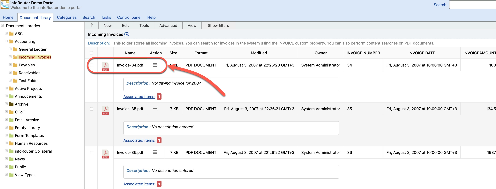
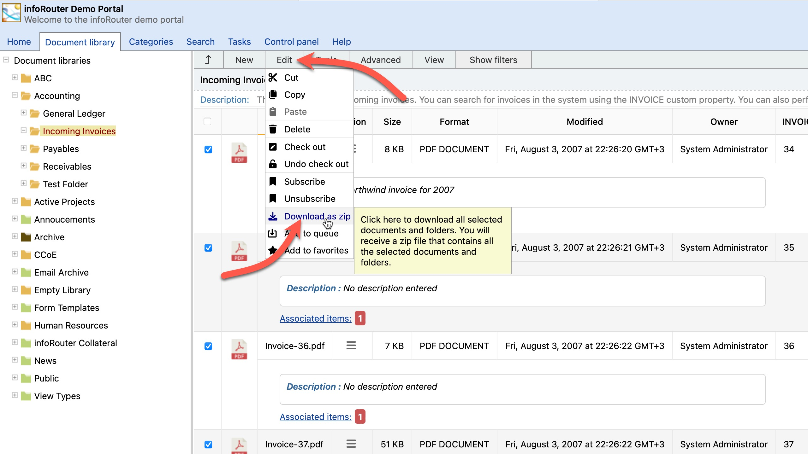

# Viewing Documents

To view a document, simply click on the document link in the Documents Panel. The document will open with its associated application on your desktop.

!!! example "Application Association"
    - Click a **PDF** → Opens in Adobe Acrobat Reader
    - Click a **Word document** → Opens in Microsoft Word
    - Click an **Excel file** → Opens in Microsoft Excel

---

## Downloading Documents

### Download a Single Document

To download a document for offline viewing:

1. **Right-click** on the document link
2. Select **"Save Target As..."** (or "Save Link As..." depending on browser)
3. Choose a location on your computer
4. Click **Save** to complete the download

---

### Download Multiple Documents

To download several documents at once:

1. Navigate to the folder containing the documents
2. Check the boxes next to the documents you want to download
3. Click the **Edit** menu
4. Select **"Download as Zip"**

!!! success "Bulk Download"
    infoRouter compresses the selected documents into a single ZIP file and downloads it to your desktop. This is much faster than downloading files one at a time.

---

## Quick Reference

| Action | How To |
|--------|--------|
| **View document** | Click the document link |
| **Download single file** | Right-click → Save Target As |
| **Download multiple files** | Select checkboxes → Edit → Download as Zip |

---

## See Also

- [Working with Documents](Documents.md)
- [Check Out Documents](CheckOut.md)
- [Document Versions](DocumentVersions.md)
- [Uploading Documents](UploadingDocuments.md)