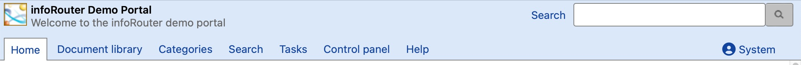
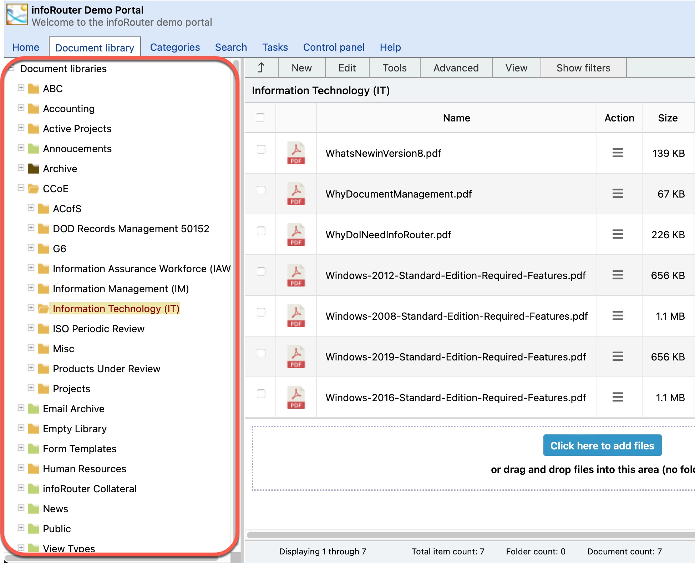

# The infoRouter Work Area

infoRouter includes a portal interface that greets users. Depending on the options chosen by the creator of the portal, certain navigation options may or may not be available.

You can find out more about this topic in the **"Portal"** section of this help document. The infoRouter Document Library is designed to look and function similar to the Microsoft Windows Explorer.

Folders are displayed on the left, and files (documents) are displayed on the right.

To navigate effectively, take note of the following sections (tabs) of infoRouter:

Home Tab:

Clicking on this tab will navigate you to your portal page.

Document Library Tab:

Clicking on this tab will navigate you to the infoRouter Document Library. The infoRouter Document Library is where you view, edit and create documents and folders.

Categories Tab:

Clicking on this tab will navigate you to the infoRouter Category Screen. In this screen, you may click on any of the predefined searches (sometimes called saved searches) to display a list of documents that match the predefined search criteria.

Search:

Clicking on this tab will navigate you to the infoRouter Search screen.
  
 In this screen you will be able to search for documents and folders using the "Advanced Search" option or one of the available "Saved Search" options.

My Tasks Tab:

This tab will only appear when you are logged in by supplying a valid user name and password. Clicking on this tab will navigate you to a screen that contains all of your tasks. You may look at completed tasks, pending and overdue tasks that have been assigned to you by other infoRouter users. This screen also shows tasks that have been assigned by you to other infoRouter users.

Control Panel Tab:

This tab will not appear to most users. It only appears to the System Administrator and Library Managers. Clicking on this link will display the infoRouter Control Panel window which allows you to perform administrative functions such as adding users, creating libraries, creating and editing user groups, etc.

Help Tab:

Displays a collection of selected help topic links of commonly used functions in infoRouter as well as a link to the complete help file.

Library Panel:

This panel display a list of the available libraries and folders under them (sub-folders). All root-level folders are called libraries.

Documents Panel:

This panel display a list of documents in the selected folder.

