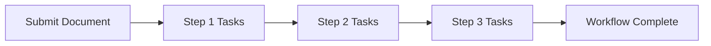

# Introduction to Workflows

The workflow features of infoRouter allow authors or authorized users to submit documents to pre-defined approval and review processes.

!!! success "Advanced Workflow Capabilities"
    infoRouter workflows support complex processes with multiple tasks (parallel and serial), document editing during review, and comprehensive notification systems.

---

## How Workflows Work

### Workflow Process

1. **Document Submission** — Author submits document to a pre-defined workflow
2. **Step Execution** — Each step contains one or more tasks
3. **Task Notifications** — Assigned users receive notifications at each step
4. **Task Completion** — Users complete required actions for each task
5. **Workflow Advancement** — Document moves to next step when all tasks complete
6. **Workflow Completion** — Document reaches final approved state

---

## Key Features

| Feature | Description |
|---------|-------------|
| :material-sitemap: **Multiple Steps** | Create workflows with as many steps as needed |
| :material-arrow-split-vertical: **Parallel Tasks** | Multiple tasks can run simultaneously within a step |
| :material-arrow-right: **Serial Tasks** | Tasks can be configured to run in sequence |
| :material-file-edit: **Document Editing** | Documents can be edited while in workflow |
| :material-bell: **Notifications** | Automatic notifications to task assignees |
| :material-undo: **Reject/Return** | Reviewers can reject and return documents to submitter |

---

## Task Types

### Approval Tasks

The traditional approve/reject workflow:

| Action | Result |
|--------|--------|
| **Approve** | Document advances to next step or completes |
| **Reject** | Workflow stops, document returns to submitter |

### Custom Tasks

Tasks can be configured to perform various actions based on your organization's requirements.

---

## Documentation

:material-download: [Workflow Administrator's Guide (PDF)](https://www.infoRouter.com/downloads/V80/infoRouter_Workflows.pdf)

This comprehensive guide covers:

- Creating workflow definitions
- Configuring steps and tasks
- Assigning reviewers
- Managing active workflows

---

## See Also

- [How to Create Workflow Definitions](HowtoCreateWorkflowDefinitions.md)
- [Reviewers and Task Assignees](Reviewers.md)
- [Author Reviews](AuthorReviews.md)
- [Task Notifications](TaskNotifications.md)
